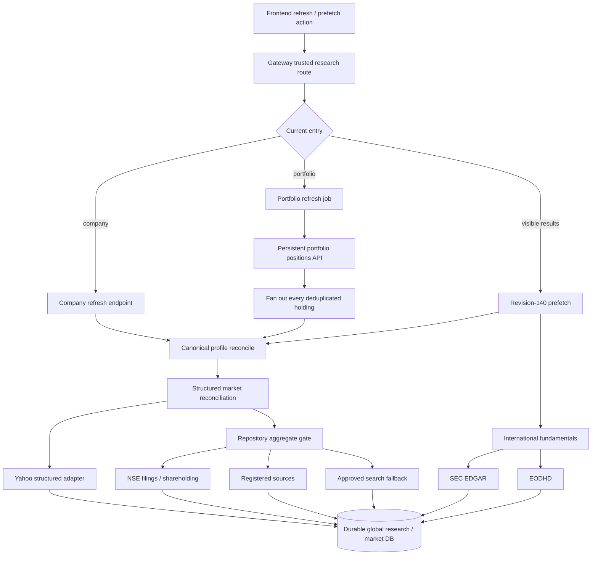
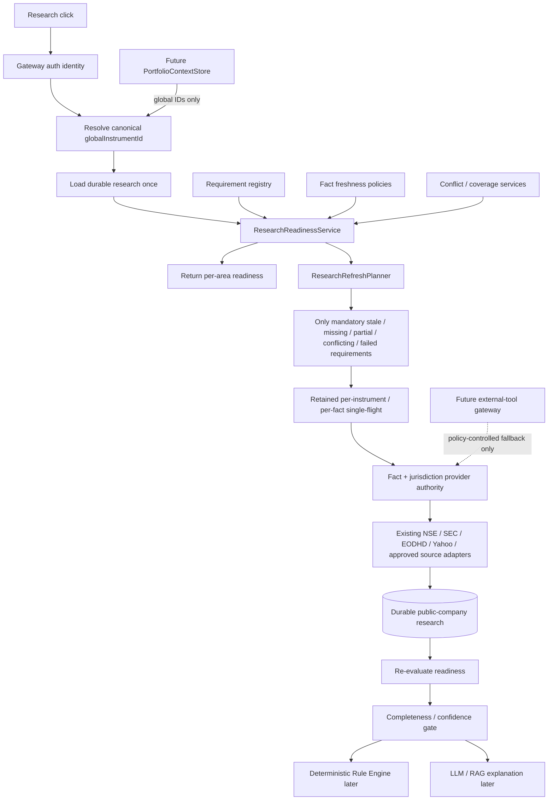

# 03.2 - Research Readiness, Rule Engine, Refresh Planner & Ephemeral Client Data

## Iteration 1 outcome

This iteration inventories the current refresh architecture and adds an additive migration seam. It does not switch any runtime endpoint, delete any old path, alter a provider adapter, migrate portfolio persistence, calculate the proposed weighted score, deploy code, truncate a table, or delete runtime data.

Files changed in this iteration:

- `ai/research-engine/app/research_readiness.py`: requirement, readiness, freshness, authority, conflict, coverage, planner, and future external-tool contracts.
- `ai/research-engine/app/portfolio_context.py`: the future ephemeral portfolio context boundary, with no selected implementation.
- `ai/research-engine/tests/test_research_readiness.py`: focused behavior tests.
- `docs/architecture/03.2-safe-research-reset.sql`: generated, unexecuted reset SQL.
- `services/research-service/src/test/java/com/aiinvestment/research/ResearchFlywayMigrationTest.java`: aligns the existing migration assertion with V7 and verifies the protected market-price table.

Deployment performed: none. Runtime data mutation performed: none.

## 1. Complete old refresh inventory

The inventory was built by searching all source, test, SQL, documentation, and configuration files under `frontend`, `ai/research-engine`, `services/research-service`, `services/portfolio-service`, `services/api-gateway`, `config`, `infrastructure`, `shared`, and `docs`. Generated output, dependency folders, bytecode, logs, binary fixtures, and backup `.bak` files were excluded. Search phrases included all phrases in the iteration request, followed by endpoint-string and symbol/caller tracing.

The 104 inventory rows each contain exactly one migration classification. “Delete?” means safe to delete in this iteration. No row is approved for deletion.

### Frontend

| File | Symbol / method / endpoint | Current responsibility | Callers | Side effects | Persisted tables | Provider calls | Delete? | Reuse? | Classification |
|---|---|---|---|---|---|---|---|---|---|
| `frontend/app/lib/portfolio-api.ts` | `MarketIntelligenceResearchState`, `ResearchPrefetchResponse` | Models process-local prefetch states returned by the old ensure endpoint. | `investment-workspace.tsx`, frontend prefetch tests. | None. | None. | None; HTTP contract only. | No; active contract. | Partly, until readiness response replaces it. | `REPLACE_ORCHESTRATOR` |
| `frontend/app/lib/portfolio-api.ts` | `ResearchRefreshJob` | Models portfolio-scoped broad refresh job progress. | Workspace polling/progress UI. | None. | Mirrors `research.research_refresh_jobs`. | None. | No; active contract and replacement absent. | No long term; planner jobs need a requirement-level model. | `REMOVE_OBSOLETE_JOB_MODEL` |
| `frontend/app/lib/portfolio-api.ts` | `researchApi.refresh()` -> `POST /companies/{id}/refresh` | Starts explicit company-wide refresh. | Research view refresh callback. | Network POST. | Indirectly all rebuildable research tables and structured snapshots. | Indirectly Yahoo/NSE/search/SEC/EODHD according to identity. | No; live caller. | Endpoint slot can become readiness/planner backed. | `REPLACE_ORCHESTRATOR` |
| `frontend/app/lib/portfolio-api.ts` | `prefetchVisible()`, `getPrefetchState()` | Submits and polls revision-140 visible-result prefetch. | Sector results effect and research-open flow. | Network POST/GET. | Indirect research persistence. | Indirect provider calls when old freshness gate is not complete. | No; accepted behavior is active. | Yes, as a compatibility shell over readiness/single-flight. | `KEEP_SINGLE_FLIGHT` |
| `frontend/app/lib/portfolio-api.ts` | `refreshPortfolio()`, `getRefreshJob()`, `getActiveRefreshJob()` | Starts and polls broad portfolio research jobs. | Workspace portfolio refresh controls/effects. | Network POST/GET. | Mirrors `research_refresh_jobs`. | Indirect per-instrument provider work. | No; live caller. | Only the polling UX pattern may be reused. | `REPLACE_ORCHESTRATOR` |
| `frontend/app/components/investment-workspace.tsx` | visible-result prefetch effect around `researchApi.prefetchVisible(visibleMarketIntelligenceIds)` | Automatically starts research work after sector results render. | React effect keyed by visible global IDs. | Starts remote background work. | Indirect research writes. | Indirect old prefetch orchestration. | No; revision-140 path must remain until planner wiring exists. | Effect timing and dedupe key can be reused. | `KEEP_SINGLE_FLIGHT` |
| `frontend/app/components/investment-workspace.tsx` | `openMarketIntelligenceResearch()` | Selects a canonical instrument, starts prefetch, ensures a regional watchlist, and adds membership. | Sector performance row click. | Creates/reuses watchlist and membership; starts research prefetch. | Portfolio schema `watchlists`, `watchlist_memberships`; indirect research tables. | Indirect old prefetch providers. | No; multiple active behaviors. | Canonical selection and regional watchlist isolation. | `REPLACE_ORCHESTRATOR` |
| `frontend/app/components/investment-workspace.tsx` | prefetch status polling effect | Observes `REFRESHING`, then reloads durable summary without scheduling a second job. | Selected Market Intelligence instrument. | Network reads only. | None directly. | None. | No. | Yes, polling can observe a planner/single-flight job later. | `KEEP_SINGLE_FLIGHT` |
| `frontend/app/components/investment-workspace.tsx` | company `onRefresh` callback and “Refresh research” control | Runs broad company refresh and replaces the visible summary. | Research view. | Network POST and UI state mutation. | Indirect research writes. | Indirect broad provider path. | No; replacement UI is absent. | Selection/loading handling only. | `REMOVE_OBSOLETE_UI` |
| `frontend/app/components/investment-workspace.tsx` | portfolio `onPortfolioRefresh`, active-job discovery/poll/completion effects, `GlobalResearchRefreshProgress`, “Refresh portfolio research” | Manages portfolio-wide refresh lifecycle and reloads the portfolio summary. | Research view for a portfolio context. | Starts job, polls, updates visible state. | Indirect `research_refresh_jobs` plus research tables. | Indirect broad per-instrument provider calls. | No; active and replacement absent. | Progress presentation can be adapted to requirement targets. | `REMOVE_OBSOLETE_UI` |
| `frontend/app/lib/market-intelligence.ts` | `researchStateLabel()` | Presents prefetch state labels. | Market Intelligence rows. | None. | None. | None. | No. | Replace labels with requirement/area readiness later. | `REPLACE_ORCHESTRATOR` |

### API gateway and auth boundary

| File | Symbol / method / endpoint | Current responsibility | Callers | Side effects | Persisted tables | Provider calls | Delete? | Reuse? | Classification |
|---|---|---|---|---|---|---|---|---|---|
| `services/api-gateway/src/main/java/com/aiinvestment/apigateway/PortfolioRouteController.java` | `routeResearch()` / `/api/v1/research/**` | Transparently routes research requests and adds gateway-verified identity headers. | Frontend research API. | Downstream HTTP call; removes untrusted identity headers before adding trusted ones. | None directly. | None directly. | No. | Yes, unchanged for readiness and planner endpoints. | `KEEP_AUTH_IDENTITY` |
| `services/api-gateway/src/main/java/com/aiinvestment/apigateway/GatewayAuthenticationFilter.java` | authenticated request attributes used by `routeResearch()` | Validates the session/JWT identity before routing. | Gateway route controller. | Request attribute mutation only. | None. | Auth service/JWT validation path, not research providers. | No. | Yes. | `KEEP_AUTH_IDENTITY` |
| `services/api-gateway/src/main/resources/application.yml` | `research.engine.base-url` | Routes the gateway to research-engine. | `PortfolioRouteController`. | Configuration only. | None. | None. | No. | Yes. | `KEEP_AUTH_IDENTITY` |

### Research API and composition root

| File | Symbol / method / endpoint | Current responsibility | Callers | Side effects | Persisted tables | Provider calls | Delete? | Reuse? | Classification |
|---|---|---|---|---|---|---|---|---|---|
| `ai/research-engine/app/main.py` | module-level `repository`, `portfolio_orchestrator`, `refresh_job_manager`, `market_intelligence_research_prefetch` | Wires the old orchestration graph. Manager construction marks orphaned running jobs failed. | ASGI process import. | Opens configured persistence; may update orphaned job status. | `research_refresh_jobs`. | None at construction. | No. | Composition root can wire the new services later. | `REPLACE_ORCHESTRATOR` |
| `ai/research-engine/app/main.py` | `ensure_visible_company_research()` / `POST /api/v1/research/prefetch` | Authenticates and submits up to ten global IDs to revision-140 prefetch. | Frontend `prefetchVisible`. | Creates process-local tasks. | Indirect research writes. | Indirect through `_ensure_one`. | No. | Yes, batch/auth boundary and accepted single-flight semantics. | `KEEP_SINGLE_FLIGHT` |
| `ai/research-engine/app/main.py` | `visible_company_research_state()` / `GET /api/v1/research/prefetch/{instrument_id}` | Reads process-local prefetch status without starting provider work. | Frontend polling. | None. | None. | None. | No. | Yes as an observation endpoint until durable planner jobs exist. | `KEEP_SINGLE_FLIGHT` |
| `ai/research-engine/app/main.py` | `refresh()` / `POST /api/v1/research/companies/{instrument_id}/refresh` | Reconciles canonical profile, restores it, then enters broad structured and document refresh. | Frontend `researchApi.refresh`; API tests. | Identity/mapping reconciliation and research writes. | Portfolio `instrument_master`, `instrument_provider_mappings`; research documents/events/facts/shareholding/runs/structured snapshots. | Yahoo, official NSE, registered sources, and configured search. SEC/EODHD are called by the separate revision-140 prefetch sequence. | No; active and no runtime replacement. | Route can call readiness then planner. | `REPLACE_ORCHESTRATOR` |
| `ai/research-engine/app/main.py` | `backfill_company_research()` / `POST /companies/{instrument_id}/backfill` | Forces deep missing-evidence repair while retaining single-flight and durable reuse. | No repository caller found; API remains externally reachable. | Same writes as repository backfill. | Rebuildable research tables and refresh runs. | Official/search fetch paths. | No; external operational use is unproven. | Potential admin repair action behind planner. | `UNKNOWN_REQUIRES_EVIDENCE` |
| `ai/research-engine/app/main.py` | `refresh_portfolio_research()` / `POST /portfolios/{portfolio_id}/refresh` | Authorizes and creates a portfolio-scoped broad refresh job. | Frontend portfolio refresh. | Reads portfolio positions and creates job. | `research_refresh_jobs`; indirect research tables. | Indirect per-instrument. | No. | Auth/error boundary only. | `REPLACE_ORCHESTRATOR` |
| `ai/research-engine/app/main.py` | `refresh_job_status()`, `active_refresh_job()` | Reads old portfolio refresh job lifecycle. | Frontend job polling/recovery. | DB reads. | `research_refresh_jobs`. | None. | No; callers remain. | No long term; replace with requirement-level plan/run state. | `REMOVE_OBSOLETE_JOB_MODEL` |
| `ai/research-engine/app/main.py` | company/events/documents/summary/presentation and portfolio-summary GET routes | Projects existing durable research and canonical identity. | Frontend research reads. | Reads; profile restoration may read canonical identity. | Research documents/events/facts/shareholding/structured snapshots; portfolio identity/positions for portfolio summary. | No research provider on summary routes. | No. | Durable read projection is reusable after readiness is added. | `KEEP_PERSISTENCE` |
| `ai/research-engine/app/main.py` | `structured_market_snapshot()` / `POST /structured-market/snapshot` | Internal provider-neutral quote/snapshot endpoint used by portfolio-service manual price refresh. | `StructuredMarketClient`. | Persists structured snapshot and price observations. | `global_structured_market_snapshots`, `global_market_price_observations`, possibly `global_financial_facts`. | Yahoo structured provider. | No. | Yes; explicitly outside old broad research removal. | `KEEP_MARKET_DATA` |
| `ai/research-engine/app/main.py` | market-data population/ensure/job endpoints | Starts/observes Nifty universe and historical price population. | Frontend market-data ensure and operational flows. | Durable universe/price writes and process-local jobs. | Portfolio `nifty500_universe`; research `global_market_price_observations`. | Nifty/NSE identity and Yahoo historical prices. | No. | Yes. | `KEEP_MARKET_DATA` |
| `ai/research-engine/app/main.py`, `ai/research-engine/app/scheduler.py` | `schedule()`, `default_schedule_rules()` | Exposes source-type intervals; no in-repository scheduler caller was found. | Public GET endpoint and tests/documentation only. | None. | None. | None. | No; external caller is unknown. | Replace source-wide intervals with requirement policies. | `REPLACE_ORCHESTRATOR` |

### Research orchestration, state, persistence, and provider boundaries

| File | Symbol / method / endpoint | Current responsibility | Callers | Side effects | Persisted tables | Provider calls | Delete? | Reuse? | Classification |
|---|---|---|---|---|---|---|---|---|---|
| `ai/research-engine/app/market_intelligence_research.py` | `VisibleResearchEnsureRequest` | Validates a bounded list of canonical global IDs. | Prefetch POST route. | None. | None. | None. | No. | Yes as a batch request primitive. | `KEEP_SINGLE_FLIGHT` |
| `ai/research-engine/app/market_intelligence_research.py` | `MarketIntelligenceResearchPrefetch.submit/state/wait`, `_tasks`, `_is_fresh` | Revision-140 process-local per-instrument task dedupe and freshness reuse. | Prefetch routes and tests. | Creates bounded background tasks; keeps process-local state. | Reads existing research through repository freshness. | None before the freshness miss. | No. | Yes; planner should reuse this behavior internally. | `KEEP_SINGLE_FLIGHT` |
| `ai/research-engine/app/market_intelligence_research.py` | `_ensure_one()` | Restores/reconciles identity, calls international fundamentals, then invokes broad instrument refresh. | Prefetch task. | Identity mapping and research writes. | Portfolio mappings; research facts/documents/events/shareholding/snapshots/runs. | SEC EDGAR/EODHD and old instrument provider flow. | No. | Single-flight wrapper only; sequencing must be replaced by readiness/plan. | `REPLACE_ORCHESTRATOR` |
| `ai/research-engine/app/refresh_jobs.py` | `ResearchRefreshJobManager` | Creates durable portfolio jobs, runs each portfolio instrument, and records aggregate progress/errors. | Portfolio refresh/status API. | Creates asyncio tasks and job rows; on startup abandons orphaned running rows. | `research_refresh_jobs`; indirect research tables. | Indirect through `refresh_portfolio`. | No; live endpoints depend on it. | Only generic task observation/error hygiene. | `REMOVE_OBSOLETE_JOB_MODEL` |
| `ai/research-engine/app/portfolio_orchestration.py` | `global_instrument_metadata()`, `restore_global_profile()`, `reconcile_global_profile()`, `_resolve_profile()`, `_resolve_etf_profile()` | Resolves the canonical global instrument and hydrates a research profile. | Company refresh/read, prefetch, portfolio refresh. | Reconcile POST can update canonical mappings; profile registration is process-local. | Portfolio `instrument_master`, `instrument_provider_mappings`. | Official mapping clients behind portfolio-service; no research content provider. | No. | Yes; must happen before readiness. | `KEEP_CANONICAL_IDENTITY` |
| `ai/research-engine/app/portfolio_orchestration.py` | `_persist_verified_provider_mapping()`, `_trusted_provider_mapping()`, `_hydrate_verified_exchange_mappings()` | Preserves verified provider ownership in portfolio-service and supplies mappings to adapters. | International fundamentals and position projection. | PUT of verified mapping. | Portfolio `instrument_provider_mappings`. | None beyond mapping endpoint. | No. | Yes. | `KEEP_PROVIDER_MAPPING` |
| `ai/research-engine/app/portfolio_orchestration.py` | `refresh_instrument()` | Always considers structured-market reconciliation, then calls ETF or repository research refresh. | Company endpoint, prefetch, portfolio worker. | Structured snapshot/fact writes followed by document research writes. | `global_structured_market_snapshots`, `global_financial_facts`, research documents/events/shareholding/runs. | Yahoo plus repository official/search path. | No. | Provider calls can be decomposed into requirement executors. | `REPLACE_ORCHESTRATOR` |
| `ai/research-engine/app/portfolio_orchestration.py` | `refresh_portfolio()`, `_refresh_portfolio_instrument()` | Fans broad refresh across every deduplicated holding with bounded concurrency and failure isolation. | Job manager and tests. | Reads customer holdings; writes global research; invokes progress callback. | Indirect portfolio positions and research tables. | Per-instrument structured/official/search providers. | No. | Concurrency/failure isolation can be reused after plans exist. | `REPLACE_ORCHESTRATOR` |
| `ai/research-engine/app/portfolio_orchestration.py` | `prepare_portfolio_refresh()`, `_load_positions()`, `_dedupe_instruments()` | Loads persistent positions, converts local IDs to global IDs, copies verified mappings, and deduplicates. | Job submission and portfolio summary. | GET positions also triggers portfolio-service user upsert, quote lookup, and `ensureMaster`. | Portfolio `app_users`, `portfolio_positions`, `instrument_master`, `instrument_provider_mappings`; quote cache. | Market-data provider may run while formatting positions. | No. | Dedupe/global-ID projection belongs behind `PortfolioContextStore`. | `REPLACE_ORCHESTRATOR` |
| `ai/research-engine/app/portfolio_orchestration.py` | `_reconcile_structured_market()`, `_structured_due_classes()`, `_persist_structured_snapshot()`, `structured_quote()` | Uses market-session and per-class freshness to collect/persist structured market data. | `refresh_instrument`, portfolio worker, internal snapshot route. | Snapshot, observation, and Yahoo statement-fact writes; provider failure state. | `global_structured_market_snapshots`, `global_market_price_observations`, `global_financial_facts`, market schedules. | Yahoo Finance. | No. | Yes; planner should invoke it only for matching facts. | `KEEP_MARKET_DATA` |
| `ai/research-engine/app/portfolio_orchestration.py` | `refresh_international_fundamentals()` | Chooses the existing regional fundamentals adapter and persists normalized facts/mappings. | Revision-140 prefetch. | Financial fact upserts and verified mapping PUT. | `global_financial_facts`; portfolio provider mappings. | SEC EDGAR for USA, EODHD for Europe. | No. | Yes as fact-specific execution behind authority policy. | `KEEP_PROVIDER_ADAPTER` |
| `ai/research-engine/app/portfolio_orchestration.py` | `read_portfolio_summary()`, `_read_company_state*()`, `_finalize*()` | Builds a portfolio-keyed research read model from positions and global durable research. | Portfolio summary API. | Primarily reads; position endpoint has the side effects noted above. | Portfolio positions/identity and research facts/documents/events/shareholding/snapshots. | No research provider. | No. | Company projection is reusable; portfolio acquisition must move behind context store. | `REPLACE_ORCHESTRATOR` |
| `ai/research-engine/app/repository.py` | `_instrument_refresh_flights`, `refresh()` and `backfill()` outer task gates | Shares one process-local refresh task per global instrument, including forced backfill. | Orchestrator and tests. | Creates/cleans asyncio tasks. | None directly. | None before delegated task. | No. | Yes; planner execution should retain it. | `KEEP_SINGLE_FLIGHT` |
| `ai/research-engine/app/repository.py` | `_InstrumentRefreshGate`, `_CATEGORY_STRATEGIES`, `_category_is_eligible_to_check()`, `_category_evidence_timing()`, `_category_is_fresh()`, mark/check methods | Implements existing category-specific evidence/check cadence and distinguishes failed checks from successful no-change checks. | Repository refresh and revision-140 state. | Mutates process-local check timestamps; reads durable evidence. | Documents/events/shareholding. | None. | No. | Yes as inputs while moving policy definitions to the new registry. | `KEEP_FRESHNESS_PRIMITIVE` |
| `ai/research-engine/app/repository.py` | `instrument_refresh_state()` | Collapses all old categories into `FRESH_AND_COMPLETE`, `STALE`, `INCOMPLETE`, or lightweight-check state. | Revision-140 prefetch. | Durable reads only. | Documents/events/shareholding. | None. | No. | Single-flight caller can temporarily adapt; aggregate state is replaced by per-requirement readiness. | `REPLACE_ORCHESTRATOR` |
| `ai/research-engine/app/repository.py` | `_refresh_once()`, `_refresh_live()`, `_refresh_targeted()`, `_missing_categories()` | Uses scorer categories plus a hard-coded structured category set to choose and execute official, registered, and search discovery. | `refresh()` / `backfill()`. | Creates/completes runs; fetches, parses, persists, and updates process-local freshness/errors. | `research_refresh_runs`, documents/events/sources/facts/shareholding. | Registered URLs, NSE official filings/shareholding, configured search. | No. | Provider/extraction subroutines only; orchestration logic is replaced. | `REPLACE_ORCHESTRATOR` |
| `ai/research-engine/app/repository.py` | `_official_filing_flights`, `_fetch_official_filing_single_flight()`, `_reusable_official_document()` | Deduplicates official document fetch/extraction and reuses durable successful documents. | Official filing refresh path. | Process-local tasks plus document/fact/event writes on first fetch. | `research_documents`, `global_financial_facts`, `research_events`, `research_event_sources`. | Official filing attachment URL. | No. | Yes. | `KEEP_SINGLE_FLIGHT` |
| `ai/research-engine/app/repository.py` | `_reconcile_incomplete_persisted_official_financial_facts()` and official fact candidates | Repairs canonical facts from already-durable trusted NSE documents before network work. | `_refresh_live()`. | Reconciles source-owned financial facts. | `global_financial_facts`; reads `research_documents`. | None. | No. | Yes; it is DB-first repair. | `KEEP_RESEARCH_EXTRACTION` |
| `ai/research-engine/app/repository.py` | document/event/shareholding/fact/snapshot read and persist methods, `summary()` | Durable provider-neutral research store facade and read model. | Orchestrators, routes, tests. | Durable upserts and reads. | The 11 non-job Flyway-created data tables: documents, events/sources/runs, shareholding, financial facts, structured snapshots, prices, and market calendars. | None. | No. | Yes; implement the readiness data-source adapter here or beside it. | `KEEP_PERSISTENCE` |
| `ai/research-engine/app/persistence.py`, `ai/research-engine/app/postgres_persistence.py` | `ResearchPersistence`, SQLite/disabled/Postgres implementations | Own durable CRUD, merge semantics, schema checks, refresh audit, and job state. | `ResearchRepository`, job manager, tests. | SQL reads/writes; Postgres fails fast when schema is missing. | All 12 Flyway-created data tables; not Flyway history or the ad hoc backup. | PostgreSQL only. | No. | Yes, except portfolio job CRUD becomes obsolete after migration. | `KEEP_PERSISTENCE` |
| `ai/research-engine/app/models.py` | `ResearchDocument`, `ResearchEvent`, `ResearchEvidenceSource`, `ResearchLifecycleStatus`, `ResearchSummary` | Provider-neutral evidence, provenance, lifecycle, and read contracts. | Repository, extraction, scoring, API. | None by themselves. | Mirror documents/events/event sources. | None. | No. | Yes. | `KEEP_EVIDENCE_PARSING` |
| `ai/research-engine/app/models.py` | `ResearchRefreshJob`, portfolio refresh counters in `PortfolioResearchSummary` | Old portfolio-wide job/status response. | Refresh manager, API, frontend. | None by itself. | Mirrors `research_refresh_jobs`. | None. | No; replacement absent. | No long term. | `REMOVE_OBSOLETE_JOB_MODEL` |
| `ai/research-engine/app/settings.py` | research quarterly/shareholding/catalyst/annual/analyst/search cooldown settings | Existing differentiated category/check TTL primitives. | Repository gate and discovery. | Configuration only. | None. | Controls provider cadence. | No. | Yes during migration; map into fact-specific policy adapter. | `KEEP_FRESHNESS_PRIMITIVE` |
| `ai/research-engine/app/settings.py` | structured price/fundamentals/valuation/analyst and historical/Nifty freshness settings | Existing market-data freshness controls. | Structured reconciliation and market-data population/ensure. | Configuration only. | None. | Controls Yahoo/Nifty cadence. | No. | Yes. | `KEEP_MARKET_DATA` |
| `ai/research-engine/app/settings.py` | `portfolio_refresh_instrument_concurrency` | Bounds broad portfolio job fan-out and revision-140 prefetch semaphore. | Orchestrator and prefetch. | Configuration only. | None. | Limits indirect calls. | No. | Keep a renamed requirement-task limit after old job removal. | `REMOVE_OBSOLETE_JOB_MODEL` |
| `ai/research-engine/app/source_registry.py` | `RegisteredResearchSource`, `registered_sources_for()`, `approved_sources_for_categories()` | Maps approved instrument/category sources without embedding them in UI. | Repository primary and targeted discovery. | None. | None. | Supplies URLs to fetcher. | No. | Yes behind fact-specific authority selection. | `KEEP_PROVIDER_MAPPING` |
| `ai/research-engine/app/source_discovery.py` | search provider protocols/adapters and `SearchDiscoveryService` | Bounded discovery of approved publisher URLs with issuer/date/domain validation. | Repository targeted fallback. | Network search and in-memory stats/cache; no evidence persistence itself. | None. | Brave-compatible, Google-compatible, or SearxNG endpoints. | No. | Yes as approved secondary discovery. | `KEEP_PROVIDER_ADAPTER` |
| `ai/research-engine/app/source_discovery.py` | `OfficialFilingDiscovery`, `OfficialNseShareholdingDiscovery`, NSE subtype/shareholding helpers | Discovers official NSE filings and shareholding/XBRL facts. | Repository targeted refresh. | Network reads and normalized snapshot creation. | Persistence occurs in repository. | NSE corporate announcement/shareholding APIs and XBRL URLs. | No. | Yes, unchanged. | `KEEP_PROVIDER_ADAPTER` |
| `ai/research-engine/app/research_fetching.py` | `ResearchFetcher`, `HttpResearchFetcher`, `PlaywrightResearchFetcher` | Fetches approved original sources with SSRF, redirect, size, timeout, retry, and extraction controls. | Repository source ingestion. | Network I/O; no DB writes itself. | None. | Approved source URLs. | No. | Yes. | `KEEP_PROVIDER_ADAPTER` |
| `ai/research-engine/app/international_fundamentals.py` | `InternationalFundamentalProvider`, `SecEdgarFundamentalProvider`, `EodhdFundamentalProvider`, `international_provider_for()` | Existing regional normalized financial-fact adapters. | Portfolio orchestrator/preload tests. | Returns facts and verified IDs; caller persists. | Caller writes `global_financial_facts` and provider mappings. | SEC company tickers/companyfacts; EODHD fundamentals. | No. | Yes, unchanged. | `KEEP_PROVIDER_ADAPTER` |
| `ai/research-engine/app/structured_market.py` | `StructuredResearchProvider`, `YahooFinanceProvider` | Resolves verified Yahoo identity, fetches quote/fundamental/analyst/news/statement facts, rejects non-finite values, caches briefly. | Portfolio orchestrator and internal structured endpoint. | Network and process cache; caller persists. | Caller writes structured snapshots, prices, and facts. | Yahoo query endpoints and `yfinance`. | No. | Yes, unchanged. | `KEEP_PROVIDER_ADAPTER` |
| `ai/research-engine/app/structured_market.py` | identity candidates, exchange-family checks, `strongest_company_identity()` and mapping validation helpers | Protects verified Yahoo/global identity ownership. | Yahoo adapter. | None. | None. | Yahoo search only after mapping rules allow it. | No. | Yes. | `KEEP_PROVIDER_MAPPING` |
| `ai/research-engine/app/fact_precedence.py` | `FinancialFact`, `FactSourceTier`, `merge_fact()`, `fact_source_authority()` | Canonical fact identity and provider precedence; prevents fallback overwrite of official facts. | Persistence and provider normalizers. | None by itself. | Mirrors `global_financial_facts`. | None. | No. | Yes; authority registry complements rather than replaces durable tier identities. | `KEEP_PERSISTENCE` |
| `ai/research-engine/app/shareholding.py` | NSE XBRL/document parsers | Converts official source payloads into provenanced shareholding snapshots. | Repository and tests. | None until repository persists. | `global_shareholding_snapshots`, child values via caller. | None. | No. | Yes, unchanged. | `KEEP_RESEARCH_EXTRACTION` |
| `ai/research-engine/app/structured_research.py` | financial statement, shareholding, valuation, catalyst parsers/projections | Extracts and projects structured facts from durable evidence. | Repository summary/orchestrator/tests. | None by itself. | Reads document/fact/shareholding models. | None. | No. | Yes, unchanged. | `KEEP_RESEARCH_EXTRACTION` |
| `ai/research-engine/app/extraction.py`, `ai/research-engine/app/normalization.py`, `ai/research-engine/app/deduplication.py` | rule extraction, normalization, content/URL dedupe | Converts fetched documents to canonical evidence/events safely. | Repository fetch pipeline. | In-memory transformation; repository persists results. | Documents/events through caller. | None. | No. | Yes. | `KEEP_EVIDENCE_PARSING` |
| `ai/research-engine/app/entity_resolution.py` | `EntityResolver` | Resolves document evidence to a stable company/instrument using stronger identity than ticker alone. | Repository ingestion. | None. | None. | None. | No. | Yes. | `KEEP_CANONICAL_IDENTITY` |
| `ai/research-engine/app/scoring.py` | `CatalystScorer`, current category aliases and aggregate score | Produces the existing event/catalyst score, which does not match the new 11-area weighted rule contract. | Repository summaries/leaderboard/tests. | None. | Read model only. | None. | No; current product still consumes it. | Evidence/category logic needs an explicit mapping decision. | `UNKNOWN_REQUIRES_EVIDENCE` |
| `ai/research-engine/app/historical_market_data.py` | `YahooHistoricalPriceProvider`, `HistoricalPricePopulationService`, `has_year_historical_coverage()` | Daily historical price acquisition, finite-close filtering, incremental persistence, and coverage checks. | India market population jobs/tests. | Writes durable price observations. | `global_market_price_observations`. | Yahoo historical prices. | No. | Yes, unchanged. | `KEEP_MARKET_DATA` |
| `ai/research-engine/app/market_data_population.py`, `ai/research-engine/app/market_data_ensure.py`, `ai/research-engine/app/market_sessions.py`, `ai/research-engine/app/market_universe.py` | India population jobs, ensure single-flight/cooldowns, session rules, Nifty/global universe | Owns revision-139/140 market coverage behavior independently of research documents. | Market API routes and tests. | Nifty reference refresh, price population, process-local tasks/cooldowns. | Portfolio Nifty/identity tables; research price observations and schedules. | Nifty official CSV/NSE identity/Yahoo historical. | No. | Yes, unchanged. | `KEEP_MARKET_DATA` |
| `ai/research-engine/app/watchlists.py` | watchlist request models and `watchlist_research_projection()` | Composes regional membership with durable global research without refresh or holding mutation. | Watchlist API routes. | Read projection only. | Reads portfolio watchlists/identity and research data. | None. | No. | Yes. | `KEEP_PERSISTENCE` |

### Research-service schema, portfolio-service dependencies, and configuration

| File | Symbol / method / endpoint | Current responsibility | Callers | Side effects | Persisted tables | Provider calls | Delete? | Reuse? | Classification |
|---|---|---|---|---|---|---|---|---|---|
| `services/research-service/src/main/resources/db/migration/V1__research_intelligence.sql` | research documents/events/sources/runs DDL | Creates durable evidence and refresh audit schema. | Flyway. | Schema creation. | Four named tables. | None. | No. | Yes. | `KEEP_PERSISTENCE` |
| `services/research-service/src/main/resources/db/migration/V2__global_shareholding_snapshots.sql` | shareholding DDL | Creates official global shareholding snapshots/values. | Flyway. | Schema creation. | Two shareholding tables. | None. | No. | Yes. | `KEEP_PERSISTENCE` |
| `services/research-service/src/main/resources/db/migration/V3__research_refresh_jobs.sql` | portfolio refresh job DDL | Creates old durable portfolio-scoped job state. | Flyway and Python persistence. | Schema creation. | `research_refresh_jobs`. | None. | No; migration history cannot be edited and runtime uses table. | Table can be cleared, then retired only by a future forward migration. | `REMOVE_OBSOLETE_JOB_MODEL` |
| `services/research-service/src/main/resources/db/migration/V4__global_financial_facts.sql` | normalized fact DDL | Creates canonical provider-neutral financial fact store. | Flyway. | Schema creation. | `global_financial_facts`. | None. | No. | Yes. | `KEEP_PERSISTENCE` |
| `services/research-service/src/main/resources/db/migration/V5__structured_market_snapshots_and_market_sessions.sql`, `services/research-service/src/main/resources/db/migration/V7__global_market_price_observations.sql` | structured snapshot, schedules, calendar, and observations DDL | Creates market-data state and NSE session defaults. | Flyway and market code. | Schema creation/seeding. | Four market-data tables. | None. | No. | Yes, preserve during reset. | `KEEP_MARKET_DATA` |
| `services/research-service/src/main/resources/db/migration/V6__research_document_subtype.sql` | document subtype migration | Adds extraction metadata. | Flyway/repository. | Schema alteration. | `research_documents`. | None. | No. | Yes. | `KEEP_EVIDENCE_PARSING` |
| `services/research-service/src/main/resources/application.yml` | Flyway `research` schema/history configuration | Owns production schema migration and history table. | Research-service startup. | Applies forward migrations. | `flyway_schema_history_research` and migration tables. | PostgreSQL only. | No. | Yes. | `KEEP_PERSISTENCE` |
| `services/portfolio-service/src/main/java/com/aiinvestment/portfolio/api/PortfolioController.java` | `positions()` / `GET /portfolios/{id}/positions` | Returns persisted holdings with quotes and canonical master/mappings. | Research `_load_positions` and frontend. | `AppUserProvisioner.upsert`, quote lookup, `InstrumentMasterService.ensureMaster`. | `app_users`, `portfolio_positions`, instrument master/mappings; quote cache. | Configured market-data provider. | No. | Put behind `PortfolioContextStore`; add identity-only projection later. | `REPLACE_ORCHESTRATOR` |
| `services/portfolio-service/src/main/java/com/aiinvestment/portfolio/application/PortfolioService.java` | `getPositions()`, `getPortfolio()`, repositories | Enforces owner-scoped reads from persistent portfolio rows. | Portfolio controller. | DB reads; other service methods write/sync positions. | `portfolios`, `portfolio_positions` and related broker/history tables. | None in `getPositions`. | No. | DEV Postgres context adapter can wrap it temporarily. | `KEEP_PERSISTENCE` |
| `services/portfolio-service/src/main/java/com/aiinvestment/portfolio/api/GlobalInstrumentController.java`, `services/portfolio-service/src/main/java/com/aiinvestment/portfolio/application/InstrumentMasterService.java` | global lookup/enumeration/reconcile/verified-mapping endpoints and methods | Owns canonical identity and verified provider mappings independently of portfolios. | Research orchestrator, market jobs, portfolio responses. | Canonical/master and mapping upserts during reconcile. | `instrument_master`, `instrument_provider_mappings`. | Official NSE mapping clients where configured. | No. | Yes. | `KEEP_CANONICAL_IDENTITY` |
| `services/portfolio-service/src/main/java/com/aiinvestment/portfolio/application/StructuredMarketClient.java`, `services/portfolio-service/src/main/java/com/aiinvestment/portfolio/application/ManualMarketPriceService.java` | global structured snapshot client and manual public-price refresh | Updates quote cache without changing position quantities/cost. | Manual portfolio price endpoint. | Research snapshot POST and quote-cache update. | Research market tables; quote cache. | Yahoo via research engine. | No. | Yes. | `KEEP_MARKET_DATA` |
| `services/portfolio-service/src/main/java/com/aiinvestment/portfolio/application/Nifty500ReferenceService.java`, `services/portfolio-service/src/main/java/com/aiinvestment/portfolio/api/IndiaMarketUniverseController.java` | Official Nifty universe refresh/read. | Research market universe/population. | Updates global master/mappings and Nifty cache. | `nifty500_universe`, instrument master/mappings. | Nifty constituent CSV and NSE security master. | No. | Yes, unchanged. | `KEEP_MARKET_DATA` |
| `services/portfolio-service/src/main/java/com/aiinvestment/portfolio/api/WatchlistController.java`, `services/portfolio-service/src/main/java/com/aiinvestment/portfolio/application/WatchlistService.java`, `services/portfolio-service/src/main/resources/db/migration/V18__regional_research_watchlists.sql` | Authenticated regional watchlist persistence isolated from portfolios. | Research watchlist proxy and frontend. | Watchlist/membership writes only. | `watchlists`, `watchlist_memberships`. | None. | No. | Yes. | `KEEP_PERSISTENCE` |
| `config/dev/application.env.example`, `config/prd/application.env.example` | research live/search/persistence, cooldown, structured freshness settings | Runtime configuration examples. | Deploy/local operators. | Configuration only. | None. | Enables/configures providers. | No. | Yes; add fact-policy overrides only when operationally needed. | `KEEP_FRESHNESS_PRIMITIVE` |
| `infrastructure/helm/ai-investment-platform/templates/ai-services.yaml`, `infrastructure/helm/ai-investment-platform/values.yaml`, `infrastructure/helm/ai-investment-platform/values-dev.yaml`, `infrastructure/helm/ai-investment-platform/values-prd.yaml` | research deployment, persistence, provider/search limits, cooldown | Deploys research-engine and waits for Flyway readiness. | Helm. | Kubernetes resources/secrets/config. | Indirect research DB. | Enables configured provider endpoints. | No. | Yes. | `KEEP_PERSISTENCE` |
| `docs/research-intelligence.md` | Phase 3/4 refresh pipeline and API description | Documents the current broad refresh architecture. | Engineers/operators. | None. | Names current tables. | Names source paths. | No; historical/current behavior remains relevant. | Update after runtime cutover. | `REPLACE_ORCHESTRATOR` |

### Adjacent freshness and portfolio-privacy dependencies

These files matched the repository-wide terms but do not initiate research refreshes. They are included because they either preserve market-data freshness or carry private portfolio/broker state across the boundary.

| File | Symbol / method / endpoint | Current responsibility | Callers | Side effects | Persisted tables | Provider calls | Delete? | Reuse? | Classification |
|---|---|---|---|---|---|---|---|---|---|
| `docs/architecture.md`, `docs/architecture/phase-5e-scalable-multi-broker-architecture.md` | broker orchestration and broker/quote freshness architecture | Documents broker ownership, persistent portfolios, and separate quote freshness. | Engineers/operators. | None. | Documents portfolio/broker tables. | Names broker and market adapters. | No. | Preserve as migration context; update only when the privacy design is implemented. | `KEEP_PERSISTENCE` |
| `docs/frontend-ui-ux-requirements.md`, `docs/market-data.md` | freshness vocabulary and display requirements | Defines public market quote provenance/freshness independently of research readiness. | Frontend and market-data implementers. | None. | None. | None. | No. | Yes; research facts must not replace quote freshness. | `KEEP_MARKET_DATA` |
| `services/broker-service/src/main/java/com/aiinvestment/broker/api/BrokerConnectionResponse.java`, `services/broker-service/src/main/java/com/aiinvestment/broker/api/BrokerProviderResponse.java`, `services/broker-service/src/main/java/com/aiinvestment/broker/api/BrokerSnapshotResponse.java`, `services/broker-service/src/main/java/com/aiinvestment/broker/application/BrokerConnectionService.java`, `services/broker-service/src/main/java/com/aiinvestment/broker/domain/BrokerConnection.java`, `services/broker-service/src/main/java/com/aiinvestment/broker/persistence/BrokerConnectionEntity.java`, `services/broker-service/src/main/java/com/aiinvestment/broker/persistence/BrokerConnectionMapper.java`, `services/broker-service/src/main/resources/db/migration/V3__ibkr_read_only_metadata.sql` | broker connection/snapshot freshness and position snapshot transport | Persists connection/session metadata and sends private broker positions to portfolio-service. | Broker APIs and portfolio `BrokerSnapshotClient`. | Broker connection updates and snapshot reads. | Broker `broker_connections`; portfolio persistence occurs downstream. | Configured broker connector, not research providers. | No; outside this iteration. | Later feed an ephemeral portfolio context without entering global research. | `KEEP_PERSISTENCE` |
| `services/broker-service/src/test/java/com/aiinvestment/broker/api/BrokerControllerTest.java`, `services/broker-service/src/test/java/com/aiinvestment/broker/application/BrokerConnectionServiceStatusTest.java` | broker data-freshness contract tests | Protects broker status/snapshot behavior. | Maven. | Test doubles/DB only. | Broker test schema. | Mocked. | No. | Yes. | `KEEP_PERSISTENCE` |
| `services/portfolio-service/src/main/java/com/aiinvestment/portfolio/api/CombinedPortfolioHoldingResponse.java`, `services/portfolio-service/src/main/java/com/aiinvestment/portfolio/api/PortfolioHistoryResponse.java`, `services/portfolio-service/src/main/java/com/aiinvestment/portfolio/api/PortfolioPositionResponse.java`, `services/portfolio-service/src/main/java/com/aiinvestment/portfolio/application/BrokerSnapshotClientResponse.java`, `services/portfolio-service/src/main/java/com/aiinvestment/portfolio/domain/PortfolioPosition.java`, `services/portfolio-service/src/main/java/com/aiinvestment/portfolio/domain/PortfolioValuationPoint.java`, `services/portfolio-service/src/main/java/com/aiinvestment/portfolio/infrastructure/persistence/PortfolioMapper.java`, `services/portfolio-service/src/main/java/com/aiinvestment/portfolio/infrastructure/persistence/PortfolioPositionEntity.java`, `services/portfolio-service/src/main/java/com/aiinvestment/portfolio/infrastructure/persistence/PortfolioValuationSnapshotEntity.java`, `services/portfolio-service/src/main/resources/db/migration/V3__broker_position_provenance.sql`, `services/portfolio-service/src/main/resources/db/migration/V7__portfolio_valuation_snapshots.sql` | private holding quantity/cost/value/P&L and its source freshness | Portfolio service, controller projections, history, and research `_load_positions`. | Persistent position/valuation reads and writes. | `portfolio_positions`, `portfolio_valuation_snapshots` and related portfolio rows. | None directly. | No; portfolio migration is deferred. | These types must move behind or be projected by `PortfolioContextStore`. | `KEEP_PERSISTENCE` |
| `services/portfolio-service/src/test/java/com/aiinvestment/portfolio/application/PortfolioImportServiceIntegrationTest.java`, `services/portfolio-service/src/test/java/com/aiinvestment/portfolio/application/PortfolioServiceIntegrationTest.java` | portfolio persistence, isolation, valuation, and freshness tests | Protects the current Postgres implementation and ownership boundary. | Maven. | H2/test persistence. | Portfolio test schema. | Mocked broker/market paths. | No. | Reuse for the DEV adapter; add shared contract tests for memory/Redis implementations later. | `KEEP_PERSISTENCE` |
| `services/portfolio-service/src/main/java/com/aiinvestment/portfolio/api/QuoteResponse.java`, `services/portfolio-service/src/main/java/com/aiinvestment/portfolio/infrastructure/market/FallbackMarketDataProvider.java`, `services/portfolio-service/src/main/java/com/aiinvestment/portfolio/infrastructure/market/MockMarketDataProvider.java`, `services/portfolio-service/src/main/java/com/aiinvestment/portfolio/infrastructure/market/RedisQuoteCache.java` | current quote provenance, status, cache, and fallback | Portfolio reads/manual public-price refresh. | Quote cache reads/writes. | Redis quote cache. | Configured market-data provider. | No. | Yes, independently of research refresh. | `KEEP_MARKET_DATA` |
| `services/portfolio-service/src/test/java/com/aiinvestment/portfolio/application/PlatformEventSerializationTest.java`, `services/portfolio-service/src/test/java/com/aiinvestment/portfolio/infrastructure/market/FallbackMarketDataProviderTest.java`, `services/portfolio-service/src/test/java/com/aiinvestment/portfolio/infrastructure/market/MockMarketDataProviderTest.java`, `services/portfolio-service/src/test/java/com/aiinvestment/portfolio/infrastructure/market/RedisQuoteCacheTest.java` | market freshness/cache/event contract tests | Protects the public market-data boundary. | Maven. | Test cache/doubles only. | None durable in these tests. | Mocked. | No. | Yes. | `KEEP_MARKET_DATA` |
| `shared/java/domain/src/main/java/com/aiinvestment/shared/domain/event/MarketQuoteUpdatedEvent.java`, `shared/java/domain/src/main/java/com/aiinvestment/shared/domain/market/DataProvenance.java`, `shared/java/domain/src/main/java/com/aiinvestment/shared/domain/market/MarketDataFreshness.java`, `shared/java/domain/src/main/java/com/aiinvestment/shared/domain/market/MarketDataStatus.java`, `shared/java/domain/src/main/java/com/aiinvestment/shared/domain/market/Quote.java` | shared quote freshness/provenance contracts | Portfolio market providers and platform events. | None. | None. | None. | No. | Yes, unchanged. | `KEEP_MARKET_DATA` |

`frontend/tsconfig.tsbuildinfo` was the only unmatched generated search hit. It is a TypeScript build artifact, not source or configuration, and is excluded from the code inventory.

### Relevant regression tests

| File | Symbol / method / endpoint | Current responsibility | Callers | Side effects | Persisted tables | Provider calls | Delete? | Reuse? | Classification |
|---|---|---|---|---|---|---|---|---|---|
| `ai/research-engine/tests/test_market_intelligence_research_prefetch.py` | prefetch freshness, bounded batch, identity, failure isolation, task dedupe tests | Protects revision-140 single-flight behavior. | Pytest. | Test doubles/process tasks only. | None. | Stubbed. | No. | Yes. | `KEEP_SINGLE_FLIGHT` |
| `ai/research-engine/tests/test_research_engine.py` | repository refresh, targeted discovery, category cadence, official filing single-flight/backfill tests | Protects current provider/persistence primitives and old orchestration. | Pytest. | SQLite/test-double writes. | SQLite mirror. | Mock transports. | No. | Keep primitive assertions; replace broad orchestration assertions after cutover. | `KEEP_FRESHNESS_PRIMITIVE` |
| `ai/research-engine/tests/test_research_api.py`, `ai/research-engine/tests/test_portfolio_orchestration_timeout.py` | company/portfolio refresh routes and orchestration/error behavior | Protects current endpoints and broad workflow. | Pytest. | Test client and doubles. | Test persistence. | Stubbed. | No. | Rewrite against readiness/planner during cutover. | `REPLACE_ORCHESTRATOR` |
| `ai/research-engine/tests/test_official_nse_financial_parsing.py`, `ai/research-engine/tests/test_shareholding.py` | official NSE financial/shareholding freshness, parsing, persistence, and regressions | Protects accepted India provider behavior. | Pytest. | Test persistence. | SQLite mirror. | Fixtures/mocks. | No. | Yes, unchanged. | `KEEP_RESEARCH_EXTRACTION` |
| `ai/research-engine/tests/test_structured_market.py`, `ai/research-engine/tests/test_structured_market_persistence.py`, `ai/research-engine/tests/test_international_mapping_boundary.py` | Yahoo/SEC/EODHD mapping, structured freshness, finite values, persistence | Protects accepted structured/provider behavior. | Pytest. | Test persistence/cache. | SQLite mirror. | Mocked. | No. | Yes, unchanged. | `KEEP_PROVIDER_ADAPTER` |
| `ai/research-engine/tests/test_market_data_ensure.py`, `ai/research-engine/tests/test_india_market_data_population.py`, `ai/research-engine/tests/test_historical_market_data.py`, `ai/research-engine/tests/test_market_sessions.py`, `ai/research-engine/tests/test_global_instrument_universe.py` | Nifty, 481/481 population assumptions, daily history, mapping, and sessions | Protects market-data revisions 139/140. | Pytest. | Test jobs/persistence. | SQLite/test doubles. | Fixtures/mocks. | No. | Yes, unchanged. | `KEEP_MARKET_DATA` |
| `ai/research-engine/tests/test_watchlists.py` | Route separation and no-refresh watchlist projection | Protects regional watchlist isolation. | Pytest. | Test doubles. | None. | None. | No. | Yes. | `KEEP_PERSISTENCE` |
| `frontend/tests/market-intelligence-prefetch.test.mjs` | detached prefetch, backend-owned provider routing, no duplicate scheduling | Protects revision-140 UI behavior. | Node test runner. | Source inspection only. | None. | None. | No. | Yes until planner UI cutover. | `KEEP_SINGLE_FLIGHT` |
| `frontend/tests/public-research-ui.test.mjs`, `frontend/tests/phase5e-ui.test.mjs` | refresh controls/job progress and canonical identity UI behavior | Protects current broad UI and reusable identity rules. | Node test runner. | Source inspection only. | None. | None. | No. | Split identity assertions from obsolete refresh assertions in Iteration 2. | `REMOVE_OBSOLETE_UI` |
| `frontend/tests/market-int-sector-and-watchlist.test.mjs` | click prefetch plus regional watchlist/portfolio isolation | Protects combined current click flow. | Node test runner. | Source inspection only. | None. | None. | No. | Keep watchlist isolation; replace prefetch expectation. | `REPLACE_ORCHESTRATOR` |
| `services/research-service/src/test/java/com/aiinvestment/research/ResearchFlywayMigrationTest.java` | Verifies research schema tables/columns/history. | Maven test. | H2 schema creation. | Research schema. | None. | No. | Yes; expected latest version must track V7. | `KEEP_PERSISTENCE` |
| `services/api-gateway/src/test/java/com/aiinvestment/apigateway/PortfolioRouteControllerTest.java`, `services/api-gateway/src/test/java/com/aiinvestment/apigateway/GatewayAuthenticationFilterTest.java` | Verifies routing and trusted identity propagation. | Maven test. | Mock HTTP only. | None. | None. | No. | Yes. | `KEEP_AUTH_IDENTITY` |
| `services/portfolio-service/src/test/java/com/aiinvestment/portfolio/api/PortfolioControllerTest.java`, `services/portfolio-service/src/test/java/com/aiinvestment/portfolio/api/WatchlistControllerTest.java`, `services/portfolio-service/src/test/java/com/aiinvestment/portfolio/application/GlobalInstrumentReconciliationServiceTest.java`, `services/portfolio-service/src/test/java/com/aiinvestment/portfolio/application/InstrumentMasterServiceTest.java`, `services/portfolio-service/src/test/java/com/aiinvestment/portfolio/application/Nifty500ReferenceServiceTest.java`, `services/portfolio-service/src/test/java/com/aiinvestment/portfolio/application/NseIdentityReconciliationLifecycleTest.java`, `services/portfolio-service/src/test/java/com/aiinvestment/portfolio/application/NseMappingReconciliationServiceTest.java`, `services/portfolio-service/src/test/java/com/aiinvestment/portfolio/application/StructuredMarketClientTest.java` | Protects position ownership, global identity, Nifty, mappings, watchlists, and market data. | Maven test. | Test DB/mocks. | Portfolio test schema. | Mocked. | No. | Yes. | `KEEP_CANONICAL_IDENTITY` |

## 2. KEEP / REPLACE / REMOVE decision

No physical removal is safe yet. Live callers still exist for company refresh, portfolio refresh jobs, and prefetch. The replacement data-source adapter and planner executor are intentionally not wired in this iteration.

Across 104 inventory rows: 73 are `KEEP_*`, 20 are `REPLACE_ORCHESTRATOR`, 9 are removal candidates after cutover (6 job-model and 3 UI rows), and 2 are `UNKNOWN_REQUIRES_EVIDENCE`. No endpoint is classified `REMOVE_OBSOLETE_ENDPOINT` because every candidate is still externally reachable or has an active caller.

Keep unchanged:

- provider adapters and approved-source fetching;
- canonical instrument identity and verified provider mapping ownership;
- durable research persistence, normalized facts, evidence parsing, and NSE/XBRL extraction;
- market data, market sessions, Nifty universe, historical population, and non-finite Yahoo-close handling;
- process-local instrument/filing/prefetch single-flight and existing successful-no-change cadence;
- gateway authentication and regional watchlist isolation.

Replace behind stable boundaries:

- scorer-coverage-as-requirements and the hard-coded structured category set;
- company and portfolio broad refresh orchestration;
- prefetch `_ensure_one()` provider sequence;
- direct portfolio-position acquisition in research orchestration;
- source-type schedule policy and broad UI refresh actions.

Remove only after Iteration 2 cutover and focused caller tests:

- portfolio-wide `ResearchRefreshJob` model/table API usage;
- broad “Refresh research” and “Refresh portfolio research” UI flows;
- old endpoints only after compatibility routing is no longer needed.

`backfill_company_research` remains `UNKNOWN_REQUIRES_EVIDENCE`: no repository caller was found, but external operational use cannot be disproved from source.

## 3. New contracts added

`research_readiness.py` adds:

- `ResearchRequirementRegistry` and `ResearchRequirement`;
- `ResearchRequirementStatus` with `READY_FRESH`, `READY_STALE`, `PARTIAL`, `MISSING`, `CONFLICTING`, `UNSUPPORTED`, `REFRESHING`, and `FAILED`;
- `ResearchReadinessDataSource`, `DurableResearchSnapshot`, `ResearchReadinessService`, `ResearchRequirementReadiness`, and `ResearchReadinessResult`;
- `FreshnessPolicyRegistry`, `FreshnessPolicy`, and explicit policy modes;
- `ResearchRefreshPlanner`, `ResearchRefreshPlan`, and `ResearchRefreshTarget`;
- `ProviderAuthorityRegistry`, `ProviderAuthorityPolicy`, `ProviderAuthority`, and `ProviderFallbackPolicy`;
- `ResearchConflictResolver` and `ResearchCoverageService`;
- `ExternalResearchToolGateway`, an interface only, with no MCP implementation;
- `UPLOAD_EVIDENCE`, `FIND_DATA`, and `RUN_PARTIAL_ANALYSIS` actions.

Each per-requirement result exposes `requirementId`, `ruleEngineArea`, `mandatory`, `status`, `source`, `sourceTier`, `asOf`, `retrievedAt`, `age`, `freshnessPolicy`, `evidenceIds`, `missingReason`, `conflictReason`, and `supportedActions` in provider-neutral Python form. An API serializer is deferred until the durable adapter and endpoint are wired.

`portfolio_context.py` adds immutable `PortfolioContext` and `PortfolioHoldingContext` values plus the `PortfolioContextStore` protocol. It selects no storage technology and changes no existing portfolio persistence.

## 4. Rule Engine areas and weights

| Area | Weight | Default requirement IDs |
|---|---:|---|
| Valuation | 18% | `VALUATION_INPUTS` |
| Fundamental / Business Quality | 16% | `BUSINESS_QUALITY_FACTS` |
| Growth | 14% | `GROWTH_FACTS` |
| Balance Sheet | 9% | `BALANCE_SHEET_FACTS` |
| Quarterly / Earnings Trend | 9% | `QUARTERLY_FINANCIALS` |
| Order Book / Capacity / Catalysts | 8% | `ORDER_BOOK_CAPEX_GUIDANCE` |
| Price / Technical | 7% | `LATEST_PRICE`, `HISTORICAL_PRICE_SERIES` |
| News / Geopolitical / Events | 7% | `CURRENT_NEWS` |
| Shareholding | 4% | `SHAREHOLDING` |
| Management / Governance | 5% | `GOVERNANCE_HISTORY` |
| Sector / Macro | 3% | `SECTOR_MACRO` |

Weights are registry metadata only. No new final score is calculated.

The default registry treats `ORDER_BOOK_CAPEX_GUIDANCE` and `SHAREHOLDING` as optional because they are not universally applicable across issuers and jurisdictions. Readiness still reports them, but the planner does not spend provider capacity on a missing optional requirement. Iteration 2 can select a jurisdiction/instrument-specific registry profile where either becomes mandatory.

## 5. Fact-specific freshness

| Policy | Mode | Conservative fallback when no calendar/session `validUntil` is supplied | Special rule |
|---|---|---:|---|
| `LATEST_PRICE` | market/session aware | 15 minutes | Adapter may supply an exchange/session-derived `validUntil`. |
| `HISTORICAL_PRICE_SERIES` | daily incremental | 36 hours | Advance the durable daily series; do not rebuild it on a research click. |
| `QUARTERLY_FINANCIALS` | release aware | 120 days | Adapter may supply issuer release-calendar `validUntil`. |
| `ANNUAL_FINANCIALS` | reporting-calendar aware | 400 days | Adapter may supply reporting-calendar `validUntil`. |
| `SHAREHOLDING` | quarterly | 120 days | Official jurisdiction support remains explicit. |
| `ORDER_BOOK_CAPEX_GUIDANCE` | event driven plus bounded periodic check | 30 days | A successful no-change check must not manufacture evidence. |
| `VALUATION_INPUTS` | fact-specific daily | 1 day | Authority remains separate from age. |
| `CURRENT_NEWS` | rolling event/publication window | 30 days | Evidence older than 30 days is excluded from current readiness/score input, but remains durable. Retrieval time cannot make old news current. |
| `GOVERNANCE_HISTORY` | unresolved history | 365-day fallback | Old unresolved evidence remains ready/queryable regardless of age. |
| `SECTOR_MACRO` | fact-specific daily | 1 day | Later adapters can split event and daily subfacts. |

## 6. Provider authority and fallback

Authority is keyed by requirement and jurisdiction:

- India financial facts: NSE / company filing, then licensed structured, approved secondary, approved external tool, user upload.
- USA financial facts: SEC EDGAR / company filing, then licensed structured, approved secondary, approved external tool, user upload.
- Europe financial facts: regulatory / company filing, EODHD, approved secondary, approved external tool, user upload.
- Current/historical price: configured market-data source selected by exchange/session/freshness, then exchange/licensed/Yahoo fallback as configured.
- India shareholding: NSE / company filing, then licensed structured, approved external tool, user upload; other jurisdictions use their regulatory/company filing policy.
- Order book/capex/guidance: company filing, regulatory filing, approved secondary, approved external tool, user upload.
- Current news: regulatory/company evidence, reputable news, approved external tool, user upload.
- Governance history: regulator/court record, company filing, reputable news, approved external tool, user upload.
- Sector/macro: official statistics or central bank, exchange/index provider, licensed structured, reputable news, approved external tool, user upload.
- Identity: ISIN or permanent ID, then exact exchange plus symbol, then name confirmation.

Equal-authority evidence conflicts only when it names the same canonical `factKey` and has different normalized `valueFingerprint` values. Lower-authority evidence does not turn a selected official fact into a conflict. `USER_UPLOAD` is below equivalent official/regulatory/structured data by default.

Every default requirement has an explicit global fact policy, with India/USA/Europe overrides where authority differs. An unregistered requirement has no generic provider ranking and fails closed until its fact-specific policy is configured.

The fallback policy permits the future external-tool gateway only for `MISSING`, `CONFLICTING`, or evidence below the configured confidence threshold. No LLM chooses fallback timing. No MCP or broker tool is implemented.

## 7. Current call graph

The company path reconciles identity before it evaluates durable category state. The portfolio path obtains every holding first. Structured reconciliation happens before the repository’s aggregate gate, although its own per-class freshness can avoid a Yahoo call. The repository then uses scorer evidence and hard-coded categories to choose targeted document discovery.

## 8. Proposed call graph

## 9. Research database reset inventory

The running DEV PostgreSQL schema was inspected read-only on 2026-09-10. It contains all V1-V7 Flyway tables plus one manually created IRFC backup table. Counts are evidence for this inventory and will naturally change with runtime activity.

A read-only cross-schema check also found 481 distinct Nifty-universe instruments with a `VERIFIED` Yahoo mapping and durable price observations for all 481. The full Nifty reference table has 498 rows; the 17 without a verified Yahoo mapping are outside that accepted 481-instrument population set.

| Table | Live rows observed | Contents | Classification | Reset decision |
|---|---:|---|---|---|
| `research.flyway_schema_history_research` | 8 | Schema creation plus successful migrations V1-V7. | `PRESERVE_SCHEMA_HISTORY` | Never delete/reset. |
| `research.research_documents` | 836 | Normalized research documents, provenance, hashes, status, subtype, normalized text. | `REBUILDABLE_RESEARCH_DATA` | Delete after child evidence/shareholding links. |
| `research.research_events` | 997 | Extracted, validated/rejected event facts and lifecycle. | `REBUILDABLE_RESEARCH_DATA` | Delete after event-source links. |
| `research.research_event_sources` | 997 | Evidence/source links and excerpts. | `REBUILDABLE_RESEARCH_DATA` | Delete first. |
| `research.research_refresh_runs` | 1,941 | Instrument refresh audit/status/counters/errors. | `REBUILDABLE_RESEARCH_DATA` | Delete after writers stop. |
| `research.global_shareholding_snapshots` | 374 | Official/global quarterly shareholding snapshots and provenance. | `REBUILDABLE_RESEARCH_DATA` | Delete after child values; before documents. |
| `research.global_shareholding_snapshot_values` | 2,729 | Category percentages and source evidence. | `REBUILDABLE_RESEARCH_DATA` | Delete before snapshots. |
| `research.research_refresh_jobs` | 25 | Portfolio-scoped broad job/status rows. | `REBUILDABLE_RESEARCH_DATA` | Delete; model retirement requires a later migration. |
| `research.global_financial_facts` | 14,019 | Canonical normalized financial facts and source tiers. | `REBUILDABLE_RESEARCH_DATA` | Delete only when provider rebuild prerequisites are accepted. |
| `research.global_structured_market_snapshots` | 498 | Mixed current price, valuation, fundamentals, analyst facts, failure/freshness state. | `PRESERVE_MARKET_DATA` | Preserve because the table mixes market state with research facts. Split later before considering partial reset. |
| `research.global_market_price_observations` | 132,100 | Durable historical market prices, including accepted India population. | `PRESERVE_MARKET_DATA` | Never include in research reset. |
| `research.market_trading_schedules` | 5 | NSE session rules. | `PRESERVE_MARKET_DATA` | Preserve. |
| `research.market_trading_calendar_exceptions` | 0 | Session holidays/special sessions. | `PRESERVE_MARKET_DATA` | Preserve. |
| `research.irfc_financial_facts_backup_20260902` | 19 | Ad hoc copy of IRFC fact columns; not present in V1-V7 Flyway. | `UNKNOWN` | Preserve until owner, retention need, and restore history are established. |

No table in the live `research` schema currently owns canonical instrument identity; that reference remains in portfolio-service `instrument_master` and `instrument_provider_mappings`, both outside this reset.

No dedicated summary or score table exists in the live research schema. Summaries and the current catalyst score are calculated read models over durable facts/evidence, so there is no additional reset target for them.

The exact generated SQL is [03.2-safe-research-reset.sql](./03.2-safe-research-reset.sql). It takes fail-fast locks, deletes only the eight `REBUILDABLE_RESEARCH_DATA` tables in foreign-key order, and verifies protected table counts in the same transaction. It uses no `TRUNCATE` and no `CASCADE`. It was not executed.

## 10. Portfolio persistence coupling points

| Coupling point | Why it blocks an ephemeral production store | Migration seam |
|---|---|---|
| `PortfolioResearchOrchestrator._load_positions()` calls `/api/v1/portfolios/{portfolioId}/positions`. | Research orchestration knows a persistent portfolio ID and assumes rows can be reloaded later. | Inject `PortfolioContextStore`; planner receives canonical IDs from one short-lived context read. |
| `prepare_portfolio_refresh()` and `read_portfolio_summary()` both call `_load_positions()`. | Both refresh and presentation depend on durable holdings. | Split global company research reads from private context composition. |
| Portfolio positions response includes quantity, average cost, market value, P&L, source metadata, and quote. | More private data crosses into research-engine than readiness needs. | Add an identity-only projection for research, or project `global_instrument_ids` inside the context owner. |
| `PortfolioController.positions()` calls `AppUserProvisioner.upsert()`. | A nominal research read can write a persistent user row. | Authenticate outside the context store and avoid user provisioning on readiness reads. |
| `PortfolioController.positions()` calls `marketDataProvider.getQuote()` and `InstrumentMasterService.ensureMaster()`. | Loading research scope can call market data and mutate canonical mapping state before readiness. | Resolve identity explicitly once, then perform a pure context read and DB-first readiness. |
| `ResearchRefreshJob` and `research_refresh_jobs` store `portfolio_id` and `requested_by`. | Job recovery assumes durable customer/portfolio identity. | Make runs global-instrument/requirement scoped; keep private request correlation in TTL context only. |
| `PortfolioResearchSummary` is keyed by `portfolio_id`; frontend effects recover active jobs by that ID. | UI recovery assumes durable portfolio-scoped jobs. | Return global readiness separately and compose it with session context client-side/service-side. |
| `_dedupe_instruments()` copies `_positionDataFreshness` and private display-name overrides into research input. | Global research execution is influenced by holding-specific metadata. | Pass canonical global ID plus public identity only; keep display/private state in the context projection. |
| Portfolio-service repositories and entities directly persist portfolios, positions, broker holdings, manual-import snapshots, cash balances, position history, and valuation history. | A Redis/in-memory implementation cannot replace these through one interface today. | Later add `PostgresPortfolioContextStore` for DEV, `InMemoryPortfolioContextStore` for tests/local, and `RedisEphemeralPortfolioContextStore` for production, then move callers incrementally. |
| Regional watchlists are durable and user-owned but deliberately contain no quantities/cost/P&L. | They are private preferences, not portfolio financial state. | Keep their isolation; decide retention independently of the portfolio context migration. |

## 11. Tests and validation

The new focused suite contains 20 tests covering:

1. fresh mandatory evidence yields an empty plan and zero provider candidates;
2. stale mandatory evidence yields only that target;
3. missing mandatory evidence yields a targeted candidate;
4. incomplete mandatory evidence is `PARTIAL` and targeted;
5. unrelated fresh data is excluded from the plan;
6. equal-authority fact disagreement is `CONFLICTING`;
7. unsupported facts are `UNSUPPORTED` and unscheduled;
8. mandatory/optional distinctions survive readiness and planning;
9. current news older than 30 days is excluded from readiness/score input without deletion;
10. old unresolved governance evidence remains queryable and ready;
11. canonical non-zero `globalInstrumentId` is required before a durable read;
12. readiness and portfolio projection do not mutate holding values;
13. market price and historical series keep separate freshness modes and are not spuriously targeted;
14. existing Yahoo/SEC/EODHD adapter contracts remain importable;
15. revision-140 prefetch single-flight methods remain present;
16. all requested readiness fields and weights are present;
17. uploaded evidence does not outrank official evidence;
18. external-tool fallback is deterministic and policy controlled;
19. provider authority differs by fact and unregistered facts fail closed;
20. `REFRESHING` and `FAILED` are representable and planned correctly.

Validation completed on 2026-09-10:

| Command/scope | Result |
|---|---|
| `python -m py_compile app/research_readiness.py app/portfolio_context.py` | Passed. |
| `python -m pytest -q tests/test_research_readiness.py` | 20 passed. |
| All 26 `ai/research-engine/tests/test_*.py` files | 562 unique cases passed: the final 20 readiness cases, 486 existing provider/orchestration cases from the combined run, and 56 remaining configuration/presentation/watchlist cases; one existing Starlette/httpx deprecation warning. The last authority-policy edit is imported only by the 20-case readiness suite. |
| Research-service Flyway test after aligning its stale V6 assertion with the existing V7 migration | 1 passed. It now verifies `global_market_price_observations` columns as well as schema version 7. |
| Selected portfolio identity, mapping, Nifty, structured-market, watchlist, and portfolio endpoint tests | 76 passed. |
| Gateway authentication tests | 4 passed. |
| Total selected passing Java tests | 81 passed, 0 failures, 0 errors, 0 skipped. |
| Four refresh/prefetch/watchlist frontend source-inspection files | 74 passed; 1 unrelated stale assertion in `frontend/tests/phase5e-ui.test.mjs` still expects the removed source expression `dashboard.combinedHoldings.map`. No frontend file was changed in this iteration. |
| Full `PortfolioRouteControllerTest` diagnostic run | 5 passed; 2 unrelated connector-session fixture errors use `/connector-sessions/test`, while current routing requires a connector UUID. Gateway authentication passed separately. No gateway file was changed. |

`ruff` is not installed in the available Python environment, so its configured lint command could not be run. Python compilation and the full research-engine pytest suite passed.

## 12. Stable paths preserved

Iteration 1 makes no edits to existing NSE fundamentals, NSE shareholding/XBRL, Nifty universe, historical population, Yahoo quote/history/mapping, SEC EDGAR, EODHD, canonical identity, provider mapping, market observation, watchlist, or single-flight implementation files. The new module imports none of those adapters and never invokes a provider.

## 13. Recommended Iteration 2 scope

1. Implement a read-only `ResearchReadinessDataSource` adapter over existing durable repository methods. Map documents, events, financial facts, shareholding snapshots, structured snapshots, price observations, and successful-no-change checks to canonical requirement evidence without changing provider code.
2. Add an authenticated `GET /api/v1/research/companies/{globalInstrumentId}/readiness` endpoint and contract serializer. Prove it makes no provider call and no portfolio mutation.
3. Add a requirement-level planner execution coordinator that reuses `_instrument_refresh_flights`, official-filing single-flight, revision-140 task dedupe, and existing provider persistence. Start with one low-risk requirement per provider path rather than switching every category together.
4. Route the Research click through readiness. Present missing/stale/unsupported/conflicting areas and supported actions. Keep old refresh endpoints as compatibility shims until focused caller tests pass.
5. Enforce the 30-day current-news selection at the Rule Engine input boundary while keeping old governance/litigation/guidance evidence in durable queries.
6. Add completeness/confidence gate contracts; do not add the final weighted score or LLM/RAG explanation yet.
7. Introduce an identity-only `PortfolioContextStore` adapter for the research scope. Keep existing Postgres portfolio persistence in DEV; do not move quantities/cost/P&L until its independent privacy migration is designed and tested.
8. Replace portfolio-scoped refresh job creation with global-instrument/requirement run state. Only after frontend and API callers move should a forward migration retire `research_refresh_jobs` and old controls.
9. Do not reset data during Iteration 2. If a reset is later approved, re-inventory the live schema and backup table immediately before running the generated transactional SQL.
