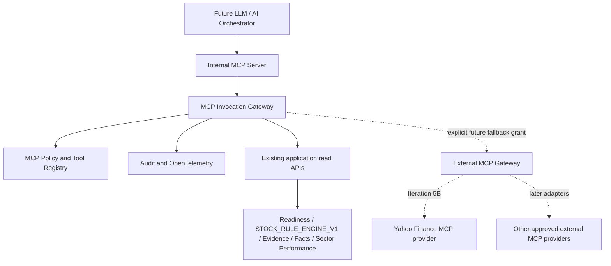

# Iteration 5A: Local Internal MCP Server and Gateway

## Decision and boundary

Iteration 5A adds a dedicated, lightweight Python service at `ai/mcp-gateway`. A separate workload gives MCP a clear tool allowlist, authorization boundary, audit stream, timeout boundary, internal-only network identity, and independent horizontal scaling. The service remains stateless and delegates all investment logic to existing application capabilities.

The service uses the [official Model Context Protocol Python SDK](https://github.com/modelcontextprotocol/python-sdk) `mcp==2.2.0` from its current stable v2 line. STDIO is the default for local development. Stateless Streamable HTTP is enabled for the internal Kubernetes workload. Neither transport changes tool behavior.



An LLM or AI orchestrator can connect only to the internal MCP server. It cannot connect directly to a broker or provider MCP server. The production container registers no external provider in 5A.

## Internal tool contracts

Every company contract requires a UUID `globalInstrumentId`. Tool input models reject extra fields, missing IDs, zero UUIDs, names, tickers, and fuzzy company strings. Identity creation and provider mapping are outside MCP.

| Tool | Input | Existing read capability | Acquisition |
|---|---|---|---|
| `get_research_readiness` | `globalInstrumentId` | `GET /api/v1/research/readiness/{id}` | Never |
| `get_company_analysis` | `globalInstrumentId`, optional `allowPartial` | `POST /api/v1/research/analysis/{id}` | Never; returns `STOCK_RULE_ENGINE_V1` |
| `get_financial_facts` | `globalInstrumentId` | Persisted company summary projection | Never |
| `get_quarterly_results` | `globalInstrumentId` | Persisted company summary projection | Never |
| `get_shareholding` | `globalInstrumentId` | Persisted company summary projection | Never |
| `get_recent_news` | `globalInstrumentId`, optional `days` | Persisted company summary projection | Never |
| `get_sector_performance` | `region`, `sector`, `period`, optional `limit` | `GET /api/v1/research/sector-performance` | Never |
| `search_research_evidence` | `globalInstrumentId`, `query`, optional `limit` | Persisted document metadata | Never |
| `get_watchlist` | `watchlistId` | Existing user-scoped watchlist research read | Never |

`get_recent_news.days` defaults to 30 and accepts only 1 through 30. Older events, including historical governance evidence, are excluded. Each returned item includes `publicationDate`, `dateBasis`, and source provenance.

The result envelope is stable across tools:

```json
{
  "ok": true,
  "tool": "get_company_analysis",
  "requestId": "request-123",
  "data": {},
  "provenance": {
    "source": "INTERNAL_APPLICATION",
    "generatedAt": "2026-09-11T10:00:00Z",
    "ruleEngineVersion": "STOCK_RULE_ENGINE_V1"
  },
  "warnings": []
}
```

Failures return the same tool and request ID with one of these safe codes: `MCP_TOOL_NOT_FOUND`, `MCP_TOOL_DENIED`, `INVALID_ARGUMENT`, `COMPANY_NOT_RESOLVED`, `READINESS_NOT_AVAILABLE`, `ANALYSIS_NOT_AVAILABLE`, `DOWNSTREAM_TIMEOUT`, `DOWNSTREAM_UNAVAILABLE`, `UNAUTHORIZED`, `FORBIDDEN`, or `EXTERNAL_PROVIDER_UNAVAILABLE`. Implementation exceptions and stack traces never enter the response.

## Registry, policy, and authentication

`McpToolRegistry` is the sole internal allowlist. Duplicate registrations fail during startup. Unknown tools fail closed. The MCP SDK publishes each strict JSON input schema through `tools/list`.

The risk classes are `SAFE_READ`, `SENSITIVE_READ`, `WRITE_NON_FINANCIAL`, `FINANCIAL_ACTION`, and `ADMIN_ACTION`. Iteration 5A permits only authenticated `SAFE_READ` definitions. The other four classes always return `MCP_TOOL_DENIED`. Trading, order, portfolio mutation, broad research refresh, and administration tools are not registered.

`McpAuthContext` contains optional `userId`, `serviceIdentity`, roles, scopes, and authentication type. LOCAL uses the configured local service identity. The Helm LOCAL profile also selects the existing dev-login `user-a` UUID so the current research authorization boundary and watchlist owner checks continue to work. A different local user can be selected with `AIP_MCP_LOCAL_USER_ID`.

AZURE uses `WORKLOAD_IDENTITY` and the existing AKS ServiceAccount federation. It introduces no client secret. The Azure profile deliberately has no static user ID, so `get_watchlist` fails closed until the future trusted AI orchestrator supplies a verified per-request user assertion. Workload Identity authenticates the workload to Azure resources; it does not replace end-user authorization.

## Privacy and canonical identity

Public company reads can resolve a canonical instrument that is not held in any portfolio. MCP never creates an instrument or provider mapping. The future external gateway rejects identity-creation fields, provider-mapping fields, and any returned `globalInstrumentId` that differs from the authorized ID, including nested fields.

Response normalization recursively removes quantity, average cost, invested amount, cost basis, profit/loss, allocation, broker-account IDs, authorization headers, cookies, API keys, passwords, tokens, client secrets, and credential-shaped fields. Bearer and JWT-shaped string values are redacted as a second guard. `get_watchlist` requires both a user ID and `watchlist:read`; the downstream application still enforces ownership.

## Audit, correlation, and telemetry

The invocation service emits structured `MCP_TOOL_INVOKED`, `MCP_TOOL_SUCCEEDED`, `MCP_TOOL_FAILED`, and `MCP_TOOL_DENIED` events. Events contain timestamp, service, environment, level, tool, request ID, service identity, authentication type, risk class, tool kind, safe result code, duration, and an active OpenTelemetry trace ID when present. Tool arguments and results are not logged.

The MCP request ID is normalized, retained in the result, and propagated to application calls as both `X-Request-ID` and `X-Correlation-Id`. Active OpenTelemetry context is also injected as W3C trace context on downstream HTTP calls. The official SDK provides OpenTelemetry spans; the workload reuses the chart's `OTEL_*` settings and is compatible with the existing Azure Monitor/OTLP collector path. No Azure Monitor SDK is embedded in business code.

## Timeouts and resilience seams

`AIP_MCP_INVOCATION_TIMEOUT_SECONDS` bounds every invocation. The HTTP client separately configures connect/read timeouts and bounded connection and keepalive pools. Timeouts map to `DOWNSTREAM_TIMEOUT`; request or response failures map to `DOWNSTREAM_UNAVAILABLE` without exception text.

`McpRateLimiter` and `McpCircuitBreaker` are provider-neutral extension contracts for a later distributed implementation. `ExternalMcpProvider.health()` is the provider health seam. External provider health is intentionally excluded from MCP readiness, and no in-process production coordination or session store was added.

## External MCP and fallback contract

`ExternalMcpProvider` exposes metadata (`providerId`, regions, supported requirements, supported tools, risk class, and auth type) plus `supports`, `invoke`, and `health`. `McpServerRegistry` rejects duplicate provider IDs. `ExternalMcpGateway` is disabled in all 5A runtime profiles.

The existing `ProviderFallbackPolicy` now issues a narrow `ExternalResearchToolAuthorization` only after it decides that a requirement may use fallback. The grant binds the canonical instrument, requirement, approved provider IDs, issuer, and issue time. The intended flow remains:

```text
ResearchRefreshPlanner
  -> ProviderFallbackPolicy
  -> ExternalResearchToolGateway
  -> MCP Gateway
  -> explicitly approved external MCP provider
```

An external provider cannot decide whether fallback is allowed. There is no Zerodha or IBKR MCP connectivity in 5A.

## Local execution

Start the existing research engine first. Then install and run the STDIO server from PowerShell:

```powershell
cd C:\workspace\ai-investment-platform\ai\mcp-gateway
python -m venv .venv
.\.venv\Scripts\python.exe -m pip install -e ".[test]"
$env:AIP_MCP_RESEARCH_BASE_URL = "http://127.0.0.1:8000"
$env:AIP_MCP_LOCAL_USER_ID = "653d39bb-f827-30c5-94cb-8296b3a56a56"
$env:AIP_MCP_SCOPES = "mcp:read,watchlist:read"
.\.venv\Scripts\python.exe -m app.main --transport stdio
```

STDIO is owned by an MCP client and carries protocol messages on stdout; structured logs go to stderr. LOCAL requires no Azure, Key Vault, Workload Identity, ACR, or Azure Monitor resource.

Run the deterministic end-to-end STDIO smoke test, which starts an ephemeral local persisted-read fixture and makes no provider calls:

```powershell
cd C:\workspace\ai-investment-platform\ai\mcp-gateway
.\.venv\Scripts\python.exe scripts\smoke_test.py
```

For local Streamable HTTP development, set `AIP_MCP_TRANSPORT=streamable-http`, `AIP_MCP_HOST=127.0.0.1`, `AIP_MCP_PORT=8001`, and connect to `http://127.0.0.1:8001/mcp`.

Static and regression validation commands are:

```powershell
cd C:\workspace\ai-investment-platform\ai\mcp-gateway
.\.venv\Scripts\python.exe -m pytest -q

cd C:\workspace\ai-investment-platform
python scripts\validate_azure_readiness.py
helm lint infrastructure\helm\ai-investment-platform -f infrastructure\helm\ai-investment-platform\values-dev.yaml
helm lint infrastructure\helm\ai-investment-platform -f infrastructure\helm\ai-investment-platform\values-azure.yaml
```

## Reused Azure deployment foundation

The existing chart now renders `mcp-gateway` through its established conventions:

- ACR repository and immutable global tag resolution
- the shared ServiceAccount and `azure.workload.identity/use: "true"` pod label
- the existing Key Vault CSI `SecretProviderClass` reference and read-only mount
- numeric non-root image user, pod/container security contexts, read-only root filesystem, and an `emptyDir` for `/tmp`
- startup, readiness, and liveness probes; readiness does not call an external provider
- configurable requests/limits, HPA, PDB, rolling update, and topology spread
- a `ClusterIP` Service and an internal-only NetworkPolicy
- existing OTLP/Azure Monitor-compatible environment settings

No MCP Ingress template exists, and chart validation rejects `mcpGateway.ingress.enabled=true` or a non-`ClusterIP` service. LOCAL keeps Workload Identity and Key Vault disabled. AZURE mounts references only and contains no secret value.

## Known 5A limits

- At the 5A boundary the production registry had no external provider. Iteration 5B adds the disabled-by-default Yahoo Finance MCP adapter described in `05b-yahoo-finance-mcp-provider.md`.
- Azure has no static end-user ID. A trusted per-request user assertion resolver is required before `get_watchlist` can be used there.
- A cross-service fallback grant will need integrity protection, expiry/replay enforcement, and authenticated transport when the research planner and provider adapter are connected over the network.
- Distributed rate limiting and circuit breaking remain contracts. Iteration 5B adds bounded provider concurrency, timeout/retry behavior, and health tracking without adding a second process-local coordination framework.
- Provider-specific egress, credentials, conformance, quotas, and legal approval remain intentionally absent.

## Next boundary

Iteration 5B implements Yahoo Finance MCP as the first provider behind `ExternalMcpProvider`; its exact policy is recorded in `05b-yahoo-finance-mcp-provider.md`. Iteration 5C supplies the repository-owned server described in `05c-first-party-yahoo-finance-mcp.md`. Later approved India and international adapters can reuse these boundaries without changing canonical identity or allowing direct LLM-to-provider access.

A later LLM/AI Orchestrator should authenticate to this internal server, pass a verified user context for user-scoped tools, consume the existing schemas, and treat MCP results as application-owned evidence. It must not reproduce readiness, scoring, authority, freshness, or financial calculations.
