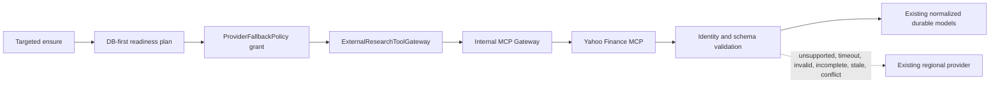

# Iteration 5B: Yahoo Finance MCP Provider and MCP-first Acquisition

## Scope and placement

`YahooFinanceMcpProvider` lives in the dedicated `ai/mcp-gateway` service created in 5A. It implements the existing `ExternalMcpProvider` contract and is registered by `McpServerRegistry` only when `AIP_MCP_YAHOO_ENABLED=true`. This preserves the internal MCP service as the only provider-facing security, schema, timeout, audit, and transport boundary. The frontend, internal MCP tools, LLMs, and rule engine cannot invoke the Yahoo server directly.

The research engine adds `McpFirstResearchCapabilityExecutor` around the existing targeted executor. It is active only when `AIP_RESEARCH_MCP_FIRST_ENABLED=true`. Research Readiness GET, company analysis, and `STOCK_RULE_ENGINE_V1` continue to read durable application state and never invoke a provider. The only path to acquisition remains the targeted readiness ensure command.



There is no Zerodha adapter and no Alpha Vantage dependency or configuration.

## Acquisition priority and durable authority

MCP-first controls which source is asked first when targeted ensure has already found a requirement that needs work. It does not change which fact wins in storage or readiness. Yahoo MCP financials use the existing `FactSourceTier.YAHOO`; the durable `merge_fact` boundary preserves official NSE facts, SEC/regulatory facts, and higher-authority structured facts for the same instrument, metric, period, period type, and reporting basis. A valid Yahoo result may therefore complete acquisition without overwriting a stronger existing value.

The central `McpFirstProviderPriority` produces these routes:

| Requirement | India | USA | Europe |
|---|---|---|---|
| `LATEST_PRICE` | Yahoo MCP → existing Yahoo structured market | Yahoo MCP → existing Yahoo structured market | Yahoo MCP → existing Yahoo structured market |
| `HISTORICAL_PRICE_SERIES` | Yahoo MCP → existing history provider | Yahoo MCP → existing history provider | Yahoo MCP → existing history provider |
| `VALUATION_INPUTS` | Yahoo MCP → NSE/approved structured path | Yahoo MCP → SEC/approved structured path | Yahoo MCP → EODHD/approved structured path |
| `BUSINESS_QUALITY_FACTS` | Yahoo MCP → NSE | Yahoo MCP → SEC EDGAR | Yahoo MCP → EODHD |
| `GROWTH_FACTS` | Yahoo MCP → NSE | Yahoo MCP → SEC EDGAR | Yahoo MCP → EODHD |
| `BALANCE_SHEET_FACTS` | Yahoo MCP → NSE | Yahoo MCP → SEC EDGAR | Yahoo MCP → EODHD |
| `QUARTERLY_FINANCIALS` | Yahoo MCP → NSE | Yahoo MCP → SEC EDGAR | Yahoo MCP → EODHD |
| `CURRENT_NEWS` | Yahoo MCP → global news/search → NSE evidence | Yahoo MCP → global news/search | Yahoo MCP → global news/search |
| `ORDER_BOOK_CAPEX_GUIDANCE` | Yahoo MCP → NSE evidence | Yahoo MCP → SEC/approved evidence | Yahoo MCP → EODHD/approved evidence |
| `SHAREHOLDING` | Yahoo MCP only with exact fields → NSE XBRL | Yahoo MCP only with exact fields → unavailable | Yahoo MCP only with exact fields → unavailable |
| `SECTOR_MACRO` | Yahoo MCP → existing approved research | Yahoo MCP → existing approved research | Yahoo MCP → existing approved research |

The fallback implementation remains the existing regional executor. No NSE parser, SEC adapter, EODHD adapter, Yahoo REST normalizer, historical population behavior, or rule-engine formula was changed.

## Capability registry

The provider publishes an explicit state per region and readiness requirement: `SUPPORTED`, `UNSUPPORTED`, `UNKNOWN`, or `TEMPORARILY_UNAVAILABLE`. A route is executable only when configuration marks it `SUPPORTED` and names one exact MCP tool. Tool discovery must return that exact name before invocation. Unknown and unavailable routes fail closed and use policy fallback.

No live Yahoo MCP server or universal tool vocabulary is assumed. Committed LOCAL and AZURE values contain an empty capability array. This means all routable capabilities default to `UNKNOWN`, except `SHAREHOLDING`, which defaults to `UNSUPPORTED`. The adapter models the broader Yahoo capability vocabulary without claiming live support:

| Capability | Readiness binding | Committed state |
|---|---|---|
| Latest price | `LATEST_PRICE` | `UNKNOWN` |
| Market history / technical price basis | `HISTORICAL_PRICE_SERIES` | `UNKNOWN` |
| Valuation inputs | `VALUATION_INPUTS` | `UNKNOWN` |
| Annual financials | `BUSINESS_QUALITY_FACTS` | `UNKNOWN` |
| Quarterly financials | `QUARTERLY_FINANCIALS` | `UNKNOWN` |
| Balance sheet | `BALANCE_SHEET_FACTS` | `UNKNOWN` |
| Growth inputs | `GROWTH_FACTS` | `UNKNOWN` |
| News | `CURRENT_NEWS` | `UNKNOWN` |
| Structured catalysts/events | `ORDER_BOOK_CAPEX_GUIDANCE` | `UNKNOWN` |
| Exact promoter/FII/DII/pledge shareholding | `SHAREHOLDING` | `UNSUPPORTED` |
| Sector/industry | `SECTOR_MACRO` | `UNKNOWN` |
| Company profile, income statement, cash flow, earnings trend, analyst data | no independent readiness route | `UNKNOWN`; never invoked directly |

An operator must replace the tool placeholder only after checking an actual server contract. A representative non-secret mapping shape is:

```json
[
  {
    "region": "INDIA",
    "requirementId": "LATEST_PRICE",
    "capability": "LATEST_PRICE",
    "tool": "REPLACE_WITH_EXACT_REVIEWED_TOOL_NAME",
    "state": "SUPPORTED",
    "maxAgeSeconds": 300,
    "requiredFields": ["latestPrice"],
    "toolArguments": {}
  }
]
```

Static tool arguments reject credential-shaped keys. The research caller supplies no tool name, so it cannot turn the gateway into an arbitrary MCP proxy.

## Transport and provider contract

The provider uses the official `mcp==2.2.0` Python SDK. It supports Streamable HTTP for an approved service endpoint and STDIO for an approved local executable. Endpoint, executable, arguments, authentication mode, header, timeout, retries, backoff, concurrency, and capability mappings are centralized settings. Tool discovery occurs before every call, required tools are allowlisted by capability configuration, and each call has a bounded timeout.

The Yahoo server must return `YAHOO_FINANCE_MCP_TOOL_V1`. Extra fields, nested fact values, non-finite numbers, non-positive prices, invalid periods, unknown metrics, non-HTTP evidence URLs, and invalid ownership percentages are rejected. Deterministic failures include `EXTERNAL_CAPABILITY_UNSUPPORTED`, `DOWNSTREAM_TIMEOUT`, `EXTERNAL_PROVIDER_UNAVAILABLE`, `EXTERNAL_PROVIDER_RATE_LIMITED`, `EXTERNAL_SCHEMA_INVALID`, `EXTERNAL_RESULT_INCOMPLETE`, `EXTERNAL_RESULT_STALE`, and `EXTERNAL_IDENTITY_CONFLICT`.

Retries are limited to zero through three and use bounded exponential backoff for transport failures. Concurrency is bounded per process. The 5A circuit-breaker protocol receives success/failure signals when a shared implementation is supplied. Existing per-instrument targeted-ensure single-flight prevents duplicate work in one process. Cross-replica distributed locking and rate limits remain an explicit production gap; no second local lock framework was added.

Provider health reports only state and capability counts. External health is excluded from Kubernetes readiness, so an unavailable future provider cannot make the internal service unready.

## Canonical identity

The request path is always:

```text
globalInstrumentId
  -> existing VERIFIED YAHOO_FINANCE provider mapping
  -> configured Yahoo MCP tool
  -> returned symbol/exchange/currency validation
  -> normalization
```

The adapter never searches by company name, creates a canonical instrument, or writes a provider mapping. The verified mapping remains owned by portfolio-service canonical reconciliation. Missing mappings fail with `VERIFIED_YAHOO_MAPPING_REQUIRED`. Returned symbol, exchange family, and currency must match the canonical profile. Identity-creation or provider-mapping fields are forbidden by the strict provider schema and by the 5A recursive gateway boundary.

## Normalization and provenance

Provider responses become existing `StructuredMarketSnapshotRecord`, `MarketPriceObservation`, `FinancialFact`, `ResearchDocument`, `ResearchEvent`, and `ShareholdingSnapshot` objects. Provider-native response blobs are not an authoritative schema. Provenance retains provider ID, exact source tool, verified symbol, canonical instrument ID, retrieval and observation/publication times, period and period type, source URL, confidence, raw field origin, and adapter version where the receiving model supports it.

Annual, quarterly, and as-at period identities remain distinct. Financial metrics are accepted only from a fixed normalized metric allowlist. The same Yahoo source tier and period semantics used by current durable facts prevent an MCP-specific interpretation from bypassing fact precedence.

Market history rejects non-finite or non-positive prices and preserves observation timestamps and currency. It does not modify the existing Yahoo REST history implementation or the India 481/481 behavior.

Current news uses publication time, requires issuer-symbol relevance, deduplicates URL/headline/publication date, and excludes items older than 30 days. It stores neutral evidence and does not add keyword materiality or change `STOCK_RULE_ENGINE_V1` news math. Older structured catalysts may be retained as events only when the configured catalyst tool supplies an event type recognized by the existing order/capex/guidance readiness adapter; a generic or unknown event type triggers fallback.

Shareholding is deliberately conservative. Generic institutional, fund, or insider ownership is not promoter holding, promoter pledge, FII/FPI, or DII. Yahoo satisfies the India requirement only when all exact promoter, pledge with basis, FII/FPI, and DII fields are present for an exact quarter-end period. Otherwise the adapter returns incomplete and targeted ensure immediately uses the unchanged NSE XBRL path.

## Authorization, privacy, audit, and correlation

`ProviderFallbackPolicy` issues a grant bound to the canonical instrument, requirement, provider ID, issuer, and time. The gateway checks that grant before capability discovery. The internal HTTP command accepts only the configured `research-engine` service identity and never accepts an arbitrary tool name. The service remains `ClusterIP` and has no public ingress.

The gateway emits `MCP_TOOL_INVOKED`, `MCP_TOOL_SUCCEEDED`, `MCP_TOOL_FAILED`, and `MCP_TOOL_DENIED` using the existing structured audit and OpenTelemetry conventions. Request and correlation IDs flow from targeted ensure through the gateway to the provider client. Arguments and results are never audit-logged. Response sanitization removes credentials and private portfolio fields, and the external wire schema rejects unknown fields such as quantity, cost basis, P&L, allocation, broker account, or token data.

An authentication token, if an approved server requires one, is a `SecretStr` loaded only from `AIP_MCP_YAHOO_AUTH_TOKEN`. Helm exposes that variable only through `secretKeyRef`; the Azure example maps `yahoo-mcp-token` through the existing Key Vault CSI `research-provider-credentials` Secret. No token appears in values, ConfigMaps, frontend variables, logs, docs, or tests. Workload Identity, ServiceAccount, Key Vault mount, OTEL, security context, resources, HPA, PDB, probes, and NetworkPolicy all reuse the existing 5A/Azure chart structure.

The internal caller identity header is defense in depth with the internal-only service and NetworkPolicy. Before enabling a cross-namespace or less trusted production route, add Entra audience-token verification and grant expiry/replay enforcement.

## Configuration and local validation

Both sides are disabled by default:

```powershell
$env:AIP_MCP_EXTERNAL_PROVIDERS_ENABLED = "false"
$env:AIP_MCP_YAHOO_ENABLED = "false"
$env:AIP_MCP_YAHOO_CAPABILITIES_JSON = "[]"
$env:AIP_RESEARCH_MCP_FIRST_ENABLED = "false"
```

For a reviewed local fake or real endpoint, configure the exact transport and capabilities, start the MCP gateway with Streamable HTTP, and then enable the research side. Do not enable it with placeholder tool names.

```powershell
cd C:\workspace\ai-investment-platform\ai\mcp-gateway
$env:AIP_MCP_TRANSPORT = "streamable-http"
$env:AIP_MCP_HOST = "127.0.0.1"
$env:AIP_MCP_PORT = "8001"
$env:AIP_MCP_EXTERNAL_PROVIDERS_ENABLED = "true"
$env:AIP_MCP_YAHOO_ENABLED = "true"
$env:AIP_MCP_YAHOO_TRANSPORT = "streamable-http"
$env:AIP_MCP_YAHOO_ENDPOINT = "http://127.0.0.1:REPLACE_WITH_PORT/mcp"
$env:AIP_MCP_YAHOO_CAPABILITIES_JSON = 'REPLACE_WITH_REVIEWED_JSON_ARRAY'
.\.venv\Scripts\python.exe -m app.main --transport streamable-http

cd C:\workspace\ai-investment-platform\ai\research-engine
$env:AIP_RESEARCH_MCP_FIRST_ENABLED = "true"
$env:AIP_RESEARCH_MCP_GATEWAY_BASE_URL = "http://127.0.0.1:8001"
python -m uvicorn app.main:app --host 127.0.0.1 --port 8000
```

Mandatory tests are offline. `tests/fake_yahoo_mcp_server.py` implements representative latest-price, history, financial, company-profile, and news tools through the official SDK and simulates timeout, malformed schema, incomplete data, identity mismatch, stale data, and health failure. No live Yahoo connectivity or secret is required.

## Azure reuse and production gaps

The Azure overlay keeps Yahoo and MCP-first research disabled until an endpoint and executable capability evidence are approved. It provides only endpoint placeholders and a Key Vault object/Secret reference. The MCP workload reuses ACR image resolution, Workload Identity pod labeling, the existing ServiceAccount, Key Vault CSI, OTEL/Azure Monitor-compatible export, ClusterIP, no ingress, NetworkPolicy, probes, resources, HPA, PDB, non-root security, read-only filesystem, and topology spreading.

Iteration 5C selected and implemented the repository-owned first-party server described in `05c-first-party-yahoo-finance-mcp.md`. Remaining production work is legal/data-rights approval of its Yahoo acquisition mechanism, production egress allowlisting, shared circuit-breaker/rate-limit state, distributed targeted-ensure locking, Entra service-to-service audience validation if required, grant expiry/replay protection, and operational quota/cost limits. Unsupported capabilities stay `UNKNOWN` or `UNSUPPORTED` and use the tested regional fallbacks.

The next external-provider iteration can add reviewed India and international adapters for requirements the first-party Yahoo server cannot satisfy, especially authoritative filings, exact shareholding, and structured corporate events. Those adapters should reuse `ExternalMcpProvider`, capability states, canonical mapping validation, normalized persistence, explicit policy grants, audit, and no-double-call semantics. It must not reintroduce Zerodha as a research provider or add trading operations.
