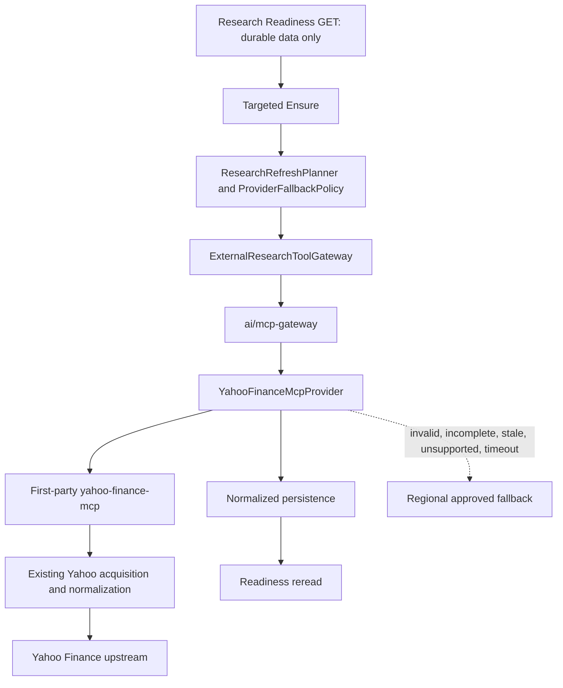

# Iteration 5C: First-party Yahoo Finance MCP

## Decision and boundary

The repository owns the Yahoo Finance MCP server at `ai/yahoo-finance-mcp`. This removes the runtime dependency on an unknown third-party MCP package while preserving the Iteration 5A boundary: research orchestration calls the generic MCP gateway, and only the gateway calls an approved external-provider MCP service. The frontend and a future LLM cannot call Yahoo directly.

The server is a dedicated stateless process because Yahoo acquisition has a different outbound-network, scaling, health, and legal boundary from gateway policy. It imports the existing research-engine Yahoo acquisition modules rather than copying their parsing rules:

- `YahooFinanceProvider.collect_verified` consumes a caller-owned verified mapping and bypasses Yahoo symbol discovery.
- Existing `YahooFinanceProvider` normalization supplies quote, profile, structured financial, analyst, sector, and news fields.
- Existing `YahooHistoricalPriceProvider` supplies the proven historical-close behavior and non-finite filtering.
- Existing `FactSourceTier.YAHOO` and repository merge behavior remain responsible for durable fact precedence.

The MCP service adapts those existing normalized objects to `YAHOO_FINANCE_MCP_TOOL_V1`. It does not persist data, mappings, canonical identity, portfolio context, or provider-native response blobs.

## Request path



`GET readiness` and `STOCK_RULE_ENGINE_V1` analysis never enter this acquisition path. Only a targeted ensure with the existing narrow fallback authorization grant can do so. A successful, complete Yahoo result is persisted and stops the route; it produces zero regional fallback calls.

## MCP protocol and transports

Both the first-party service and generic gateway use the official Python SDK `mcp==2.2.0`.

- STDIO is available for direct local contract testing.
- Stateless Streamable HTTP is available at `/mcp` for local k3d and future AKS service-to-service traffic.
- `/health` reports process/tool-registry health.
- `/health/ready` reports local readiness and deliberately does not make a Yahoo request.

The server has no proprietary protocol endpoint. Its only non-MCP routes are the two health endpoints.

## Registered SAFE_READ tools

| Tool | Required identity | Additional input | Output |
|---|---|---|---|
| `get_quote` | `globalInstrumentId`, `verifiedYahooSymbol`, `region` | optional `exchange`, `currency` | positive finite price, observation/retrieval time, exchange, currency, source |
| `get_price_history` | same | `lookbackDays` from 2 through 3650 | bounded, ordered close observations |
| `get_company_profile` | same | none | provider company name, sector, industry |
| `get_financials` | same | none | annual canonical statement facts plus proven structured valuation/fundamental inputs |
| `get_quarterly_financials` | same | none | quarterly canonical statement facts with period end and reporting basis |
| `get_news` | same | `days` from 1 through 30 | deduplicated issuer-scoped articles with publication time |
| `get_sector_industry` | same | none | sector and industry supporting evidence |
| `get_analyst_data` | same | none | only present Yahoo target/recommendation/count fields |

All function schemas are advertised with `additionalProperties: false`, and the protocol middleware independently rejects unknown arguments. Values pass strict Pydantic response validation. NaN, Infinity, non-positive prices, malformed dates, unknown response fields, and unsafe URLs fail closed; returned collections are capped by the configured response-item bound.

The service does not register symbol search, arbitrary URL/HTTP fetch, arbitrary MCP invocation, catalysts, shareholding, filesystem, shell, portfolio, account, broker, trading, order, or administrative tools.

## Canonical identity

The application must resolve:

```text
globalInstrumentId -> verified YAHOO_FINANCE provider mapping -> MCP request
```

The MCP server accepts no fuzzy company-name input. It never discovers a substitute symbol and never writes a provider mapping. `globalInstrumentId` and `verifiedYahooSymbol` are echoed through the strict response. Existing Yahoo acquisition also checks returned symbol, exchange family, currency, and security type when those fields are available. A material conflict becomes `YAHOO_MCP_IDENTITY_MISMATCH`, which the gateway maps to `EXTERNAL_IDENTITY_CONFLICT`; the regional fallback may then run under existing policy. No response field can replace the canonical UUID, verified ISIN, exchange, currency, or provider mapping.

Representative contract fixtures cover `HAL.NS`, `RBLBANK.NS`, `AAPL`, `MSFT`, and the existing European-style `BESI.AS` mapping. They are test fixtures, not production mapping writes.

## Capabilities and regional fallback

The chart contains 36 explicit region/requirement decisions. The following tools are executable for INDIA, USA, and EUROPE; success still requires per-result completeness:

| Requirement | State | Tool |
|---|---|---|
| `LATEST_PRICE` | `SUPPORTED` | `get_quote` |
| `HISTORICAL_PRICE_SERIES` | `SUPPORTED` | `get_price_history` |
| `VALUATION_INPUTS` | `SUPPORTED` | `get_financials` |
| `BUSINESS_QUALITY_FACTS` | `SUPPORTED` | `get_financials` |
| `GROWTH_FACTS` | `SUPPORTED` | `get_financials` |
| `BALANCE_SHEET_FACTS` | `SUPPORTED` | `get_financials` |
| `QUARTERLY_FINANCIALS` | `SUPPORTED` | `get_quarterly_financials` |
| `CURRENT_NEWS` | `SUPPORTED` | `get_news` |
| `SECTOR_MACRO` | `SUPPORTED` | `get_sector_industry` |
| `COMPANY_PROFILE` | `SUPPORTED` | `get_company_profile` |
| `ANALYST_DATA` | `SUPPORTED` | `get_analyst_data` |
| `SHAREHOLDING` | `UNSUPPORTED` | unregistered |

`ORDER_BOOK_CAPEX_GUIDANCE`/catalysts remains `UNKNOWN`; Yahoo news is not reclassified as a structured corporate event merely by keyword.

Regional fallback remains policy-owned:

- INDIA: Yahoo MCP first, then the existing requirement-specific NSE/approved India path. Exact promoter holding, promoter pledge and basis, FII/FPI, DII, and quarter-end shareholding continues directly to NSE XBRL because Yahoo shareholding is unsupported.
- USA: Yahoo MCP first, then SEC or the existing approved structured source appropriate to the requirement. SEC filing evidence keeps its regulatory authority.
- EUROPE: Yahoo MCP first, then EODHD or the existing approved structured/regulatory source appropriate to the requirement.

Fallback occurs once for an unsupported capability, upstream timeout/unavailability/rate error, malformed schema, missing required fields, insufficient periods/items, stale data, or canonical identity conflict. Tool discovery is checked before every configured call, so a missing server capability also fails closed.

## Acquisition order and fact precedence

MCP-first controls network acquisition order only. It does not assign durable authority. Yahoo financial facts enter the existing canonical `FinancialFact` model with `FactSourceTier.YAHOO`, explicit annual/quarterly period identity, `UNKNOWN` reporting basis where Yahoo does not prove a basis, source field origin, source URL, provider tool, observation/publication time, retrieval time, and confidence.

The existing merge rules retain a higher-authority NSE, SEC, or regulatory fact for the same canonical metric and period. A valid Yahoo acquisition can satisfy the requested coverage without overwriting that official value. No Yahoo-specific branch exists in `STOCK_RULE_ENGINE_V1`.

The historical tool intentionally emits the existing proven close-only observation model. It does not claim OHLCV completeness. India historical population behavior continues to use the unchanged existing adapter.

## News and analyst evidence

Yahoo news is accepted only when it has a headline, HTTP(S) URL, and publication timestamp. Results are issuer-scoped to the verified Yahoo symbol, deduplicated by URL, and limited to at most 30 days for `CURRENT_NEWS`. The existing scoring formula is unchanged, and the service does not assign materiality by keywords.

Analyst output contains only fields present in the normalized Yahoo response: low/median/mean/high target, analyst count, recommendation mean, and textual consensus. Missing/N/A fields remain absent. These values are supporting evidence and never independently produce BUY/HOLD/SELL.

## Security, privacy, and resilience

The container runs as numeric UID/GID `10002:10002`. Helm reuses the platform pod/container security context: non-root, `RuntimeDefault` seccomp, no privilege escalation, all Linux capabilities dropped, and an `emptyDir` at `/tmp` so the Azure read-only root filesystem profile remains usable.

The Kubernetes Service is always `ClusterIP`; the chart rejects public ingress and non-HTTP Kubernetes transport. The optional NetworkPolicy admits the service only from `mcp-gateway`. Yahoo uses dynamic DNS, so Kubernetes NetworkPolicy alone cannot safely express the final Yahoo hostname allowlist; production egress enforcement remains an Azure CNI/firewall/DNS-policy decision.

Requests have bounded body size, upstream timeout, response item count, and concurrency. The generic gateway retains bounded retry/backoff and its circuit-breaker seam. The server adds no process-local coordination or session state. The existing process-local targeted-ensure single-flight remains the known multi-replica limitation until the planned Redis/DB distributed coordination backend exists.

No portfolio quantities, cost basis, P&L, allocation, broker account, token, credential, authorization header, full financial payload, or news array is logged. Structured events are `YAHOO_MCP_REQUEST`, `YAHOO_MCP_SUCCESS`, `YAHOO_MCP_UNSUPPORTED`, `YAHOO_MCP_FAILED`, and `YAHOO_MCP_IDENTITY_MISMATCH`, with safe request ID, canonical UUID, verified Yahoo symbol, tool, duration, and safe error code. HTTP `X-Request-ID`/`X-Correlation-ID` and W3C trace context propagate through the boundary: the gateway injects the active context and the first-party server extracts it into the tool span. STDIO retains the correlation environment, and the workload reuses the existing OpenTelemetry environment.

The first-party server currently needs no secret and no Azure credential. Its chart uses the existing service account, OTEL, ACR image override, topology, probes, resources, HPA/PDB, security-context, Key Vault conditional-volume, and Workload Identity conditional-label helpers. Key Vault and Workload Identity are not activated for this workload until an actual Azure resource or secret requires them.

## Local operation

Create the isolated environment once:

```powershell
cd C:\workspace\ai-investment-platform\ai\yahoo-finance-mcp
python -m venv .venv
.\.venv\Scripts\python.exe -m pip install -e ..\research-engine -e ".[test]"
```

Exact direct STDIO command:

```powershell
cd C:\workspace\ai-investment-platform\ai\yahoo-finance-mcp
.\.venv\Scripts\python.exe -m yahoo_mcp_server.main --transport stdio
```

Exact standalone Streamable HTTP command:

```powershell
cd C:\workspace\ai-investment-platform\ai\yahoo-finance-mcp
$env:AIP_YAHOO_MCP_TRANSPORT = "streamable-http"
$env:AIP_YAHOO_MCP_HOST = "127.0.0.1"
$env:AIP_YAHOO_MCP_PORT = "8002"
.\.venv\Scripts\python.exe -m yahoo_mcp_server.main --transport streamable-http
```

The Helm LOCAL profile uses Kubernetes DNS `http://yahoo-finance-mcp/mcp`, enables the generic external-provider gateway and targeted MCP acquisition, and retains `ClusterIP` services. It requires no Azure, Key Vault, Workload Identity, ACR, or Azure Monitor resource.

## Offline verification

Tests use deterministic fake `yfinance` ticker objects rather than public Internet. They exercise quote, close history, profile, annual and quarterly statements, news, sector/industry, analyst data, timeout, malformed info, NaN, empty result, wrong symbol/currency/exchange, and provider failure.

The end-to-end contract starts a real stateless first-party Streamable HTTP MCP server and a real generic MCP gateway process, then runs:

```text
ResearchReadinessRuntime.ensure
 -> HttpExternalResearchToolGateway
 -> YahooFinanceMcpProvider
 -> official MCP Streamable HTTP client
 -> first-party MCP tool
 -> existing Yahoo normalizer
 -> fake Yahoo ticker
 -> normalized persistence
 -> readiness reread
```

It asserts canonical identity and provenance, exactly one Yahoo tool request, zero fallback calls on success, and `READY_FRESH` after reread. A second protocol test returns an incomplete first-party quote and asserts exactly one regional fallback.

## Manual local runtime and UI acceptance

Deployment remains a manual action outside this iteration. After the LOCAL environment has been built and deployed by the operator, expose the three internal endpoints on loopback using the operator's normal local process or port-forward workflow, then run:

```powershell
cd C:\workspace\ai-investment-platform
.\scripts\validate_yahoo_mcp_runtime.ps1
```

This checks both health endpoints, gateway health, and MCP tool discovery only. For a single canonical instrument:

```powershell
.\scripts\validate_yahoo_mcp_runtime.ps1 `
  -GlobalInstrumentId <CANONICAL_UUID> `
  -UserId <LOCAL_USER_UUID> `
  -Requirement LATEST_PRICE `
  -Ensure
```

Repeat only with selected canonical fixtures for HAL, RBLBANK, one USA stock, and one Europe stock. The script refuses non-loopback URLs, never performs a broad refresh, never mutates a portfolio, and prints only safe requirement/provider-path metadata.

UI acceptance uses the existing flow with no Yahoo-specific frontend branch: open the Research drawer, open Readiness, select Find Data for one missing requirement, wait for the targeted ensure and readiness reread, inspect Yahoo MCP provenance if returned, then run the existing analysis action. Verify application logs show the same request ID through research-engine, mcp-gateway, and yahoo-finance-mcp and show no fallback after a complete Yahoo success.

## Production gates and unsupported scope

Production enablement is deliberately false in `values-azure.yaml`. Before enabling it, review Yahoo terms and data rights, the selected `yfinance` acquisition mechanism, commercial-use implications, redistribution/caching restrictions, provider rate/availability behavior, and the approved outbound egress design. This repository does not claim that Yahoo data is unrestricted, officially licensed for every commercial use, or guaranteed for every exchange.

Remaining technical work includes distributed targeted-ensure coordination and provider health/circuit state, production quota and cache policy, service-to-service Entra audience validation if required, DNS-aware egress enforcement, and live exchange-by-exchange contract acceptance after legal approval. Exact India shareholding and structured catalyst/event extraction remain unsupported by this service and keep their existing official fallbacks.
