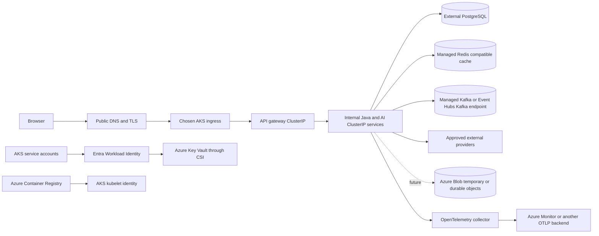

# Azure production readiness

Status: development and static validation complete; deployment is intentionally out of scope.

Audit date: 2026-09-11

> Iteration 5A addendum: the internal MCP server and `mcp-gateway` workload are now implemented. The inventory and validation totals below remain the completed pre-5A audit baseline; current MCP behavior and validation are recorded in [`05a-local-internal-mcp-gateway.md`](05a-local-internal-mcp-gateway.md).

This document is the source-of-truth inventory for moving the AI Investment Intelligence Platform from local k3d development to AKS. The audit covered the frontend, Java services, Python AI engines, IBKR connector, Helm chart, k3d configuration, Terraform, scripts, environment examples, migrations, Dockerfiles, and repository documentation. Generated build output, dependency caches, extracted binaries, and virtual environments were excluded from source findings.

The repository has no separate `k8s/` or `docker/` manifest tree, no Compose definition, and no GitHub Actions, GitLab, Jenkins, CircleCI, or Azure Pipelines configuration. Kubernetes application resources live in the Helm chart; container definitions live beside each service.

No command in this pass deployed a workload, contacted a Kubernetes cluster, created or changed an Azure resource, applied Terraform, ran an Azure deployment, changed live data, or updated an external documentation system.

## Target architecture

The design keeps business behavior independent of the hosting environment. LOCAL, TEST, and AZURE choose endpoints, credentials, transport security, persistence, and Kubernetes behavior through configuration. The Azure overlay contains identifiers and obvious `REPLACE_WITH_*` values only. It is an example that must be completed by a release system; it is not deployable production configuration.

## Readiness result

The inventory below contains **100 entries**: **67 AZURE_READY**, **7 LOCAL_ONLY_BUT_ACCEPTABLE**, and **26 deferred or externally blocked**. The 26 comprise 3 backup/recovery, 1 configuration, 3 deployment-seam, 1 identity, 1 networking, 2 observability, 3 scaling, 3 security, 2 storage-abstraction, and 7 external-decision entries. This pass implemented **66** inventory changes; 34 rows are either pre-existing controls, retained local behavior, or deferred work. An `AZURE_READY` row means the code or deployment seam can support the target behavior. It does not mean the external Azure service exists. `LOCAL_ONLY_BUT_ACCEPTABLE` identifies behavior deliberately retained for k3d or a single connector process. Any other classification is an explicit remaining decision or implementation item.

## Environment matrix

| Concern | LOCAL | TEST | AZURE |
|---|---|---|---|
| Profile | `LOCAL` | `TEST` | `AZURE` |
| Images | `localhost:5001`, mutable developer tags allowed | test supplied | ACR repository plus immutable commit tag |
| PostgreSQL | local or in-cluster PostgreSQL, SSL may be disabled | test database | external endpoint, `verify-full`, small configurable pools |
| Redis | local `redis:6379`, TLS disabled | test supplied | external endpoint, TLS and secret-backed auth |
| Kafka | in-cluster PLAINTEXT development broker | test supplied | optional provider-neutral `SASL_SSL` configuration |
| Secrets | uncommitted environment or development Kubernetes Secret | fixtures or test Secret | Key Vault CSI and Workload Identity references |
| Ingress and CORS | local ingress and explicit localhost origins | test supplied | one controlled gateway ingress, TLS, explicit public origin |
| Storage | local-path PostgreSQL PVC and optional IBKR package PVC | ephemeral/test supplied | no local-path dependency; managed data services and future Blob seam |
| Replicas | one by default | one by default | two plus HPA/PDB for proven stateless entry services; unsafe workloads remain one |
| NetworkPolicy | disabled | disabled | ingress restrictions enabled; egress waits for the chosen CNI/firewall design |
| Telemetry | OTEL SDK disabled | disabled unless a test enables it | OTLP variables enabled; collector or operator still required |
| Optional features | local flags | explicit flags | MCP, LLM, scheduled acquisition, Kafka, object storage, and IBKR disabled until approved |

The Helm sources are [`values.yaml`](../../infrastructure/helm/ai-investment-platform/values.yaml), [`values-dev.yaml`](../../infrastructure/helm/ai-investment-platform/values-dev.yaml), [`values-test.yaml`](../../infrastructure/helm/ai-investment-platform/values-test.yaml), and [`values-azure.yaml`](../../infrastructure/helm/ai-investment-platform/values-azure.yaml). `values-prd.yaml` remains a compatibility overlay, but Azure validation requires the complete Azure overlay rather than treating that legacy file as production-ready by itself.

## Identity and secrets

The chart can create a ServiceAccount, add the Workload Identity client and tenant annotations, label selected pods with `azure.workload.identity/use: "true"`, and mount a `SecretProviderClass`. Terraform enables the AKS OIDC issuer and Workload Identity, creates a user-assigned identity and federated credential, grants that identity `Key Vault Secrets User`, and grants the kubelet identity `AcrPull`.

Database, Redis, Kafka, JWT, SMTP, research-provider, and broker token mappings are secret references. The chart never requires `AZURE_CLIENT_SECRET`, a service-principal password, an ACR password, or a storage account key. The broker Key Vault adapter now reads the environment variables projected by the deployment layer, avoiding an Azure SDK dependency in business code.

One shared platform identity is currently the example default. Before production, split it into service-specific identities and vault scopes if the security review requires least privilege. The exact vault names, object names, identity client IDs, tenant ID, and access boundaries are release inputs.

## Data, storage, and recovery

| Data | Storage classification | Recovery classification | Azure direction |
|---|---|---|---|
| User identities, credentials metadata, verification state | DURABLE | MUST_BACKUP | PostgreSQL point-in-time recovery plus restore drills |
| Broker connections and canonical provider mappings | DURABLE | MUST_BACKUP | PostgreSQL backup with the owning schema |
| Instrument master and canonical identity mappings | DURABLE | MUST_BACKUP | PostgreSQL backup; preserve uniqueness and provenance |
| Current persisted portfolios, watchlists, account configuration | DURABLE under current implementation | MUST_BACKUP until privacy migration | PostgreSQL backup; later separate durable preferences from TTL private position context |
| Public research facts, evidence metadata, scores, market history | DURABLE but reconstructable | CAN_REBUILD, expensive | Back up for recovery-time control; upstream sources remain authoritative where applicable |
| Flyway schema history | DURABLE | MUST_BACKUP with database | Restore atomically with each database/schema |
| Key Vault secrets and signing material | DURABLE security configuration | MUST_RECOVER | soft delete/purge protection plus an authorized rotation/recreation runbook; never export into Git |
| ACR release images and provenance | immutable build artifacts | CAN_REBUILD from source, expensive during incident | retain approved release digests/SBOM/signatures according to release policy |
| Redis quotes and future ephemeral portfolio context | CACHE or EPHEMERAL | EPHEMERAL | TLS, authentication, TTL, eviction, and no backup assumption for private context |
| Kafka events if eventing is enabled later | depends on event contract | UNCLASSIFIED today | decide whether topics are replayable transport or a durable source before choosing retention/backup |
| Downloaded NSE PDF binary | transient | EXTERNAL_SOURCE_OF_TRUTH | Continue parsing without durable binary retention |
| Uploaded portfolio file | transient input | EPHEMERAL | Current code processes bytes without a permanent local file; future reports need a TTL store |
| Generated report/download | not implemented | EPHEMERAL target | Implement a TTL object-store interface before the feature ships |
| IBKR Gateway package | proprietary DEV_ONLY artifact | EXTERNAL_SOURCE_OF_TRUTH | Never copy the development RWO PVC model to AKS; use an approved immutable distribution channel |
| Container `/tmp` and frontend cache | EPHEMERAL | CAN_REBUILD | bounded `emptyDir`; no durability promise |

The chart exposes storage-class and object-storage settings without selecting one storage product for every workload. Azure Disk fits a true single-writer durable workload. Azure Files is reserved for a proven shared-filesystem requirement. Blob storage is the preferred future shape for temporary downloads or durable objects with object semantics. No current application requires Azure Files.

The Terraform in this repository does not create PostgreSQL, Redis, Kafka, Blob, private endpoints, backup policies, or restore automation. Select those services, define RPO/RTO and retention, enable provider-native backup, and complete a restore exercise before production data is admitted.

## Database and migration policy

The Java database clients accept host, port, database, username, password reference, SSL mode, connect/socket timeouts, and Hikari limits. The research engine accepts the corresponding PostgreSQL parameters and statement timeout. The Azure example uses `sslmode=verify-full` and a maximum pool of six connections per pod to prevent replica multiplication from exhausting PostgreSQL.

Flyway remains the schema owner in each Java service. Migration settings validate applied migrations, reject out-of-order changes, retry initial connection, and never authorize editing an applied migration. The Python research engine waits for `research-service` readiness when PostgreSQL persistence is enabled, so it does not race that schema owner. Production releases must apply backward-compatible, expand-and-contract migrations before code that depends on the new shape. Destructive contraction belongs in a later release after old replicas are gone. A dedicated migration job can replace startup ownership later, but the present singleton `research-service` release strategy is safe for the first controlled deployment.

## Scaling and duplicate-work classification

| Workload or mechanism | Classification | Current Azure control | Requirement before scaling further |
|---|---|---|---|
| frontend | HORIZONTALLY_SCALABLE | two replicas, HPA, PDB | validate cache and ingress behavior under load |
| api-gateway | HORIZONTALLY_SCALABLE | two replicas, HPA, PDB | add distributed/ingress rate limiting |
| auth-service | HORIZONTALLY_SCALABLE | two replicas, HPA, PDB | confirm mail provider and DB connection budget |
| company, recommendation, risk, notification services | HORIZONTALLY_SCALABLE based on present stateless code | HPA/PDB controls available, disabled by default | load and dependency tests before enabling |
| valuation, ranking, portfolio-optimizer | HORIZONTALLY_SCALABLE based on present stateless code | HPA/PDB controls available, disabled by default | load tests before enabling |
| portfolio-service `ACTIVE_SYNCS` | NEEDS_DB_LOCK or NEEDS_REDIS_LOCK | one replica, `Recreate` | replace process set with a cross-pod claim; keep idempotent DB writes |
| instrument reconciliation | IDEMPOTENT_ENOUGH plus DB lock | PostgreSQL advisory/pessimistic locking exists | verify contention and timeout behavior |
| research-engine acquisition and official-filing flights | NEEDS_DISTRIBUTED_DEDUPE | one replica, `Recreate`, backend explicitly `process` | implement Redis/DB lock or durable work queue with idempotency keys |
| research-service Flyway ownership | SINGLETON_BY_DESIGN for release | one replica, `Recreate` | move migrations to an explicit release phase before HPA |
| broker-service credential/session/rate/circuit state | STATEFUL and NEEDS_DISTRIBUTED_LOCK | one replica, `Recreate` | externalize transient state and coordinate runtime allocation |
| IBKR connector session lock | PROCESS_LOCAL_OK per connector instance | one connector per broker runtime | keep one active replica for each Gateway session |
| scheduled/global refresh feature | NEEDS_DISTRIBUTED_DEDUPE if enabled | feature disabled; no Kubernetes CronJob | choose one scheduler leader, queue, or DB/Redis lease |
| future MCP gateway | UNKNOWN until implementation | disabled, internal-only seam | require stateless handlers or distributed session state before HPA |

No Spring `@Scheduled` job or Kubernetes CronJob currently performs a global refresh. Research uses request-triggered background tasks and local single-flight coordination. The `scheduledJobsEnabled` flag is therefore a guard for future work, not a distributed scheduler implementation.

## Networking, TLS, and egress

Every rendered Azure Service is `ClusterIP`. Only the API gateway renders an Ingress. TLS secret, host, ingress class, and controller annotations are release inputs. MCP renders no workload or ingress because it has not been implemented, and its reserved exposure is `INTERNAL_ONLY`.

Azure CORS values require explicit HTTPS origins. The frontend uses same-origin API calls when no public API base is compiled in, keeping server credentials out of `NEXT_PUBLIC_*`. Auth public URLs, broker callbacks, connector login URLs, and provider redirect URLs are configurable.

The enabled NetworkPolicy restricts namespace ingress and admits the ingress controller only to the gateway. Same-namespace traffic remains allowed because the current service call graph is broad. Kubernetes NetworkPolicy cannot safely express the dynamic FQDN set used by market research. Outbound restriction therefore remains disabled until the team selects Azure CNI behavior plus NAT Gateway, firewall, proxy, or another FQDN-aware egress control.

| Destination class | Known destinations or behavior | Configuration / control |
|---|---|---|
| NSE and Indian market reference data | `www.nseindia.com`, `nsearchives.nseindia.com`, `www.niftyindices.com` | configured endpoints where stable; fetcher rejects loopback/private/metadata targets |
| Yahoo Finance | `query1.finance.yahoo.com`, `query2.finance.yahoo.com`, provider document links | configured discovery/quote/summary roots; HTTPS verification enabled |
| SEC EDGAR | `www.sec.gov`, `data.sec.gov` | configured ticker and company-facts endpoints |
| EODHD | `eodhd.com` | configured HTTPS base URL; API key comes from a secret reference |
| Search | disabled, SearXNG, or configured search API | explicit endpoint, allowed domains, quotas, timeouts, and secret references |
| Issuer and evidence sites | discovered public HTTPS hosts | application SSRF controls plus future firewall/proxy policy; cannot be a static IP list alone |
| IBKR | configured OAuth/API endpoint and loopback Gateway inside its connector workload | callbacks and public login base configurable; stable egress may be required |
| ICICI Direct | configured official login and Breeze API hosts | disabled until documentation is approved; secrets are referenced |
| HDFC Securities | configured provider API and callback behavior | disabled until approved; avoid URL logging because provider contracts can place a key in a query |
| SMTP | configured host and port | TLS/auth supplied by selected mail provider and Key Vault-backed Secret |
| Future LLM/MCP | no active endpoint | disabled flags; require explicit hostname and egress review before enablement |

Provider certificate verification is on by default. The IBKR development connector retains an explicit insecure switch for a local self-signed Gateway; the Azure overlay forces it off. PostgreSQL, Redis, Kafka, ingress, callbacks, and OTLP have secure Azure examples. Internal service TLS remains an infrastructure decision; current traffic is private HTTP inside the cluster.

## Availability, security, and observability

All 14 application deployments render startup, readiness, and liveness probes, requests and limits, a non-root pod context, `RuntimeDefault` seccomp, disabled privilege escalation, dropped Linux capabilities, and an optional read-only root filesystem. Bounded `emptyDir` storage supplies `/tmp` where a read-only image still needs temporary writes. Slow startup is absorbed by startup probes. Readiness checks application health and does not intentionally call an optional external provider.

Rolling update settings, topology spread, node selectors, tolerations, affinity, HPA, and PDB are values-driven. Stateful or locally coordinated services use one replica and `Recreate`; stateless entry services use rolling updates. The example permits zone spread but does not require unavailable zones in a low-cost cluster.

Java logs use a structured logfmt pattern with UTC timestamp, service, environment, level, event/message, and request ID. The Python research and IBKR services emit structured JSON and redact credential-shaped fields. Raw email verification and reset tokens are no longer logged. `X-Request-ID` and `X-Correlation-ID` are validated, returned, and propagated through gateway, portfolio, research, and IBKR calls where those paths exist. W3C trace context can be added by the selected OpenTelemetry instrumentation.

The chart emits standard OTEL service name, endpoint, protocol, enable/disable, exporter, and resource attributes. This configuration is compatible with an OpenTelemetry Collector exporting to Azure Monitor or another backend. No Azure Monitor SDK was added to business services. A collector/operator or language agents and sampling policy remain required for actual distributed traces and metrics. Telemetry must exclude raw positions, portfolio files, credentials, authorization headers, cookies, provider query secrets, and document bodies.

## CI/CD and cost controls

No repository-native GitHub Actions, GitLab, Jenkins, or other CI pipeline was present, so this pass did not invent a deployment workflow. [`scripts/validate_azure_readiness.py`](../../scripts/validate_azure_readiness.py) is the static CI entry point. A future pipeline should test, build, scan, generate an SBOM, tag images with an immutable commit digest, authenticate to Azure using OIDC federation, push to ACR, run Helm lint/template and policy checks, obtain approval, and only then perform a separately authorized Helm deployment. No Azure client secret should be stored in CI. Terraform also has no remote-state backend declaration; choose an encrypted, access-controlled backend with locking and recovery before any shared infrastructure workflow.

The chart exposes replica counts, HPA min/max, resource requests/limits, optional service flags, provider timeouts/retries, cache TTLs, research refresh windows, and disabled development dependencies. Terraform exposes node count and size. Non-production shutdown scheduling is an operations policy because stopping a shared cluster or managed database is outside application code.

## Future MCP and LLM services

MCP is represented only by a disabled configuration seam: `ClusterIP`, no public ingress, optional Workload Identity, Key Vault, OTEL, NetworkPolicy, and HPA settings. It can later support local STDIO/HTTP and an internal AKS HTTP service without forking business logic. No MCP server or deployment is rendered today.

LLM integration is also disabled. A future orchestrator must use secret references, bounded HTTP pools/timeouts, explicit model/provider configuration, OTEL with private prompt/content filtering, controlled egress, cost quotas, and idempotent/durable work coordination before horizontal scaling.

## Files changed by this audit

The pass changed 69 files. Some were already part of an in-progress working tree; the entries below identify the files to which this audit added Azure-readiness changes.

- Configuration and documentation: `config/dev/application.env.example`, `config/prd/application.env.example`, `docs/architecture/azure-production-readiness.md`.
- Frontend: `frontend/Dockerfile`, `frontend/app/config.ts`, `frontend/app/components/investment-workspace.tsx`.
- AI images: `ai/portfolio-optimizer/Dockerfile`, `ai/ranking-engine/Dockerfile`, `ai/research-engine/Dockerfile`, `ai/valuation-engine/Dockerfile`.
- Helm values: `infrastructure/helm/ai-investment-platform/values.yaml`, `values-dev.yaml`, `values-test.yaml`, `values-azure.yaml`, `values-prd.yaml`.
- Helm templates: `templates/_helpers.tpl`, `ai-services.yaml`, `api-gateway-ingress.yaml`, `dev-dependencies.yaml`, `frontend.yaml`, `ibkr-connector.yaml`, `java-services.yaml`, `network-policies.yaml`, `platform-resources.yaml`, `validate.yaml`.
- Terraform environment: `infrastructure/terraform/environments/prd/main.tf`, `outputs.tf`, `variables.tf`.
- Terraform modules: `infrastructure/terraform/modules/acr/outputs.tf`; `modules/aks/main.tf`, `outputs.tf`, `variables.tf`; `modules/key-vault/main.tf`, `outputs.tf`, `variables.tf`.
- Audit scripts: `scripts/scan_repository_secrets.py`, `scripts/validate_azure_readiness.py`.
- Java configuration: `services/api-gateway/src/main/resources/application.yml`, `services/auth-service/src/main/resources/application.yml`, `services/broker-service/src/main/resources/application.yml`, `services/company-service/src/main/resources/application.yml`, `services/notification-service/src/main/resources/application.yml`, `services/portfolio-service/src/main/resources/application.yml`, `services/recommendation-service/src/main/resources/application.yml`, `services/research-service/src/main/resources/application.yml`, `services/risk-service/src/main/resources/application.yml`.
- Java behavior: `services/api-gateway/src/main/java/com/aiinvestment/apigateway/ApiGatewayCorsConfiguration.java`, `PortfolioRouteController.java`; `services/auth-service/src/main/java/com/aiinvestment/auth/ConfiguredAuthEmailSender.java`; `services/broker-service/src/main/java/com/aiinvestment/broker/connector/ibkr/IBKRIndividualConnector.java`, `services/broker-service/src/main/java/com/aiinvestment/broker/security/AzureKeyVaultSecretProvider.java`; `services/portfolio-service/src/main/java/com/aiinvestment/portfolio/application/Nifty500ReferenceService.java`, `PortfolioService.java`, `StructuredMarketClient.java`; and `shared/java/web/src/main/java/com/aiinvestment/shared/web/CorrelationIdFilter.java`.
- Java tests: `services/api-gateway/src/test/java/com/aiinvestment/apigateway/ApiGatewayCorsConfigurationTest.java`.
- Research engine: `ai/research-engine/app/main.py`, `postgres_persistence.py`, `repository.py`, `settings.py`, `source_discovery.py`, `structured_market.py`, `tests/test_azure_configuration.py`, `tests/test_logging_configuration.py`, `tests/test_portfolio_service_configuration.py`.
- IBKR connector: `services/ibkr-connector/app/main.py`, `observability.py`, `settings.py`, `tests/test_observability.py`.

## Complete Azure-readiness inventory

| # | Classification | File | Symbol / resource | Current assumption | Azure risk | Required change | Implemented now? | Why |
|---:|---|---|---|---|---|---|:---:|---|
| 1 | AZURE_READY | `infrastructure/helm/ai-investment-platform/values*.yaml` | environment profiles | The chart previously mixed DEV/PRD conventions. | Profile drift can scatter Azure checks through services. | Define LOCAL, TEST, and AZURE centrally. | YES | The base and three overlays now select explicit profiles. |
| 2 | AZURE_READY | `config/dev/application.env.example`, `config/prd/application.env.example` | environment examples | Examples used DEV and PRD labels. | Manual launches could bypass standardized behavior. | Align examples to LOCAL and AZURE and show transport controls. | YES | Examples now expose profile, TLS, pool, Kafka, and OTEL settings without secrets. |
| 3 | AZURE_READY | `values-azure.yaml` | non-secret Azure overlay | No complete AKS example existed. | Release configuration would require redesign or ad hoc flags. | Add ACR, identity, Key Vault, external data, ingress, security, scale, and telemetry examples. | YES | The overlay uses obvious identifiers/placeholders only. |
| 4 | AZURE_READY | `scripts/validate_azure_readiness.py` | static profile validator | Azure invariants were not executable. | Regressions could reintroduce local paths or inline secrets. | Render both environments and assert safety properties. | YES | Thirty named readiness requirements are covered by static assertions. |
| 5 | AZURE_READY | Helm helpers and workload templates | image repository and tag | Image composition was chart-specific and partly hard-coded. | ACR migration could leak into application code. | Centralize registry and allow per-service repository/tag overrides. | YES | Images are deployment configuration. |
| 6 | LOCAL_ONLY_BUT_ACCEPTABLE | `values.yaml`, `values-dev.yaml`, `infrastructure/k3d/cluster-dev.yaml` | local registry | k3d uses `localhost:5001`. | That address is invalid in AKS. | Keep only in LOCAL; reject it from AZURE. | YES | Azure validation blocks localhost/k3d registries. |
| 7 | AZURE_READY | `infrastructure/terraform/modules/acr` | ACR module | ACR already had a module and login-server output. | None at source level. | Retain as a deploy-time registry. | NO | Existing abstraction was adequate. |
| 8 | AZURE_READY | `infrastructure/terraform/environments/prd/main.tf` | `aks_acr_pull` | AKS pull authorization was not joined to ACR. | Pods would require registry passwords or fail to pull. | Grant the kubelet identity `AcrPull`. | YES | Managed identity integration removes pull secrets. |
| 9 | AZURE_READY | `values-azure.yaml`, `templates/validate.yaml` | immutable image tag | Local `latest` tags were inherited. | Rollback and provenance would be ambiguous. | Require a release-supplied immutable tag. | YES | Azure render rejects `latest` and demonstrates a Git SHA. |
| 10 | AZURE_READY | `templates/platform-resources.yaml`, `_helpers.tpl` | Kubernetes ServiceAccount | Workloads relied on default service-account behavior. | Workload federation and token control were unavailable. | Make creation, name, annotations, and token mounting configurable. | YES | A named account is rendered and tokens default off. |
| 11 | AZURE_READY | `_helpers.tpl`, workload templates | Workload Identity pod label | Pods had no Azure workload label. | The webhook would not inject federated identity settings. | Label only configured Azure consumers. | YES | Selected secret consumers receive the required label. |
| 12 | AZURE_READY | `infrastructure/terraform/modules/aks` | AKS OIDC and Workload Identity | Cluster module did not enable either feature. | Long-lived service-principal credentials might be used. | Enable the OIDC issuer and Workload Identity. | YES | Both settings are configurable and enabled by default in the module. |
| 13 | AZURE_READY | `infrastructure/terraform/environments/prd/main.tf` | federated identity credential | No Kubernetes-to-Entra trust existed. | ServiceAccount tokens could not obtain an Azure identity. | Bind namespace and ServiceAccount to a user-assigned identity. | YES | Terraform declares the identity and federation subject. |
| 14 | AZURE_READY | repository-wide | Azure credential model | No actual client secret was required, but absence was not enforced. | A future edit could add a long-lived client secret. | Prohibit `AZURE_CLIENT_SECRET` and service-principal passwords in rendered config. | YES | Static validation and the secret scan enforce the current model. |
| 15 | AZURE_READY | `templates/platform-resources.yaml` | `SecretProviderClass` | Key Vault values were present but not rendered. | Pods could not consume Key Vault material. | Render the Azure provider with workload identity metadata. | YES | CSI objects and optional synchronized Kubernetes Secrets render. |
| 16 | AZURE_READY | `values-azure.yaml`, workload templates | secret mappings | DB, Redis, Kafka, JWT, SMTP, research, and broker values lacked a unified reference example. | Inline values could leak into Helm releases or ConfigMaps. | Map vault object names to referenced Secret keys. | YES | Sensitive env vars use `secretKeyRef`; no secret value is in the overlay. |
| 17 | AZURE_READY | `infrastructure/terraform/modules/key-vault` | Key Vault security | Vault defaults did not express production recovery/RBAC. | Deletion or legacy access policies could weaken recovery and control. | Enable RBAC, purge protection, and 90-day retention. | YES | Module defaults are production-oriented. |
| 18 | AZURE_READY | `AzureKeyVaultSecretProvider` | broker secret provider | The Azure branch threw an unsupported exception. | Azure broker credentials could not be injected without code changes. | Read deployment-injected environment values behind the provider interface. | YES | CSI/Secret injection works without Azure SDK coupling. |
| 19 | MISSING_AZURE_IDENTITY | `values-azure.yaml` | identity granularity | One shared platform ServiceAccount and identity are the example. | Compromise of one pod can grant broader vault access than needed. | Decide and implement per-service identities/vault roles where required. | NO | Requires a production least-privilege and operations decision. |
| 20 | AZURE_READY | four Java `application.yml` files | JDBC endpoint configuration | Local host and disabled SSL were defaults. | External Flexible Server would need TLS and bounded startup behavior. | Expose host, port, DB, user, password, SSL, and timeouts. | YES | Local defaults remain; Helm supplies Azure values. |
| 21 | AZURE_READY | `ai/research-engine/app/settings.py`, `postgres_persistence.py` | Python PostgreSQL client | SSL and timeouts were incomplete. | Connections could be insecure or hang during network faults. | Bind SSL mode, connect timeout, and statement timeout. | YES | Settings flow into psycopg connection options. |
| 22 | AZURE_READY | `values-azure.yaml` | external PostgreSQL | In-cluster PostgreSQL was the practical default. | Stateful data in AKS would inherit a dev topology. | Disable dev dependencies and point clients at an external host. | YES | No PostgreSQL workload/PVC renders in Azure. |
| 23 | AZURE_READY | Helm values and JDBC/Python clients | PostgreSQL TLS | Local `disable` could carry into production. | Credentials and data could traverse without verified TLS. | Use configurable SSL and require `verify-full` in Azure. | YES | Azure render validation asserts it. |
| 24 | AZURE_READY | Java Hikari config and Helm database pool | database connections | Library defaults multiplied by replicas were not controlled centrally. | PostgreSQL connection exhaustion. | Expose maximum/minimum size and lifetime/timeouts. | YES | Azure example limits each pod to six connections. |
| 25 | BLOCKED_EXTERNAL_DECISION | Helm `database.authMode` | PostgreSQL authentication | The implemented production example uses a Key Vault-backed password. | Entra database auth may be preferred but needs token-aware pool behavior. | Choose password versus Entra auth and implement token refresh if selected. | NO | Workload Identity alone does not make JDBC/psycopg token refresh safe. |
| 26 | AZURE_READY | database service `application.yml` files | Flyway startup | External database latency and rolling semantics were implicit. | Pods could fail early or accept an incompatible migration order. | Configure retries, validation, and out-of-order false. | YES | Startup behavior is explicit. |
| 27 | AZURE_READY | `templates/ai-services.yaml` | research schema order | Python could start before the Java Flyway owner. | Queries could race missing schema. | Gate research-engine startup on research-service readiness. | YES | An init container waits only when persistence is enabled. |
| 28 | MISSING_AZURE_DEPLOYMENT_SEAM | service-owned Flyway migrations | cross-release migration phase | Migrations still execute during Java service startup. | Complex multi-service changes may be harder to order and roll back. | Adopt schema-first release steps or a dedicated migration job. | NO | Current singleton/backward-compatible policy is adequate for a controlled first deployment, but CI/CD must own ordering. |
| 29 | LOCAL_ONLY_BUT_ACCEPTABLE | `templates/dev-dependencies.yaml` | local PostgreSQL RWO PVC | k3d persists dev data on `local-path`. | `local-path` is node-bound and unsuitable for AKS production data. | Keep dev-only and omit from Azure. | YES | Azure render contains neither PVC nor local-path. |
| 30 | AZURE_READY | portfolio Redis application/Helm config | Redis endpoint | The client assumed local unauthenticated Redis. | Managed Redis needs TLS, auth, timeouts, and bounded pools. | Expose URL/host/port, TLS, secret auth, timeouts, and pool sizes. | YES | Local and Azure transports are separate values. |
| 31 | MISSING_AZURE_STORAGE_ABSTRACTION | portfolio context code | future ephemeral portfolio store | Private portfolio state is still database/domain oriented; no shared TTL store interface exists. | Future privacy flow cannot move between replicas through Redis cleanly. | Introduce `RedisEphemeralPortfolioContextStore` or equivalent when privacy migration starts. | NO | Full portfolio migration was explicitly outside this pass. |
| 32 | AZURE_READY | Helm Kafka values/templates | Kafka transport configuration | Local broker assumed PLAINTEXT and no auth. | Managed Kafka or Event Hubs requires TLS/SASL, consumer identity, trust, and retry controls. | Add bootstrap, protocol, mechanism, username, secret, consumer-group prefix, DNS, trust-bundle mount, retries, and timeouts. | YES | Provider-neutral settings render when Kafka is enabled. |
| 33 | BLOCKED_EXTERNAL_DECISION | repository-wide eventing | Kafka provider and runtime | No business event producer/consumer currently uses the Kafka settings. | Topic/consumer semantics and service compatibility are unproven. | Select managed Kafka, Confluent, or Event Hubs only when eventing is implemented. | NO | Avoids premature Azure-specific coupling. |
| 34 | AZURE_READY | Helm `objectStorage` | object-storage deployment seam | No centralized Azure object settings existed. | A future report feature might bind directly to pod files. | Add provider, endpoint, container, auth, and temporary TTL values. | YES | Workload Identity is the expected auth mode and the feature is off. |
| 35 | MISSING_AZURE_STORAGE_ABSTRACTION | application services | object-storage implementation | No Blob/file interface exists because no durable object feature needs one today. | Future reports or evidence uploads could add local persistence. | Implement an object interface before durable or temporary objects ship. | NO | Adding an Azure SDK now would be unused vendor coupling. |
| 36 | AZURE_READY | `PortfolioImportService` | uploaded portfolio files | Multipart bytes are parsed in request flow, with no permanent file write. | No unavoidable pod-local durability currently exists. | Preserve transient processing and add TTL storage only if asynchronous processing is introduced. | NO | Existing behavior is already compatible. |
| 37 | AZURE_READY | research fetch/extraction/persistence | NSE PDF binary | The binary is fetched and parsed; evidence metadata/text is stored. | Long-lived local binaries could leak data or require shared disks. | Continue without durable binary retention. | NO | Current architecture matches the accepted rule. |
| 38 | AZURE_READY | workload templates | `/tmp` and frontend cache | Read-only filesystems still need writable temporary space. | Pods could crash or accidentally treat temp files as durable. | Mount bounded `emptyDir` and document ephemerality. | YES | All app pods receive the temporary seam. |
| 39 | LOCAL_ONLY_BUT_ACCEPTABLE | `ibkr-connector.yaml`, `values-dev.yaml` | IBKR Gateway package PVC | Development uses a proprietary package on an RWO claim and loopback Gateway. | Node affinity and mutable package content cannot be the AKS architecture. | Keep explicitly DEV_ONLY and disable in Azure. | YES | Azure rendering has no package claim or connector workload. |
| 40 | BLOCKED_EXTERNAL_DECISION | IBKR runtime architecture | immutable Gateway distribution | The repository cannot redistribute or invent the proprietary package. | Production connector pods cannot be recreated legally/reliably yet. | Agree on an approved immutable package source and lifecycle. | NO | Vendor/legal distribution decision is external. |
| 41 | AZURE_READY | all Helm Service resources | service exposure | Service types were not consistently controlled. | Internal research, broker, MCP, or data services could become public. | Default every service to ClusterIP. | YES | Static validation checks all Azure Services. |
| 42 | AZURE_READY | `api-gateway-ingress.yaml` | public ingress | Ingress was tied to local defaults and lacked complete TLS inputs. | Host/controller/TLS changes could require template edits. | Parameterize class, annotations, host, path, and TLS secret. | YES | Azure exposes only the gateway. |
| 43 | AZURE_READY | `mcpGateway` values and validation | future MCP exposure | No MCP workload exists. | A future default could expose it publicly. | Reserve ClusterIP/internal-only behavior and prohibit ingress. | YES | Azure validation asserts that no MCP resource renders. |
| 44 | AZURE_READY | gateway CORS config and Azure values | allowed origins | Local localhost origins were the effective default. | Broad or wildcard credentialed CORS is unsafe. | Supply explicit Azure HTTPS origins and reject wildcard/localhost. | YES | Gateway binding and render checks enforce the overlay. |
| 45 | AZURE_READY | auth/broker Helm values and env examples | public and OAuth callback URLs | Local callback bases were common. | OAuth/email links would point at localhost or the wrong host. | Parameterize public host, auth URL, broker callbacks, and redirects. | YES | Azure values use explicit HTTPS placeholders. |
| 46 | AZURE_READY | `serviceEndpoints`, workload templates | service discovery | Several application defaults use localhost. | Localhost inside a pod is the pod itself. | Override every inter-service URL with Kubernetes DNS. | YES | Local code defaults remain useful; Helm injects service names. |
| 47 | LOCAL_ONLY_BUT_ACCEPTABLE | `services/ibkr-connector/app/main.py` | Gateway host allowlist | Connector proxies only loopback IBKR Gateway hosts. | It cannot target an arbitrary remote Gateway. | Retain for same-workload security until the approved broker topology changes. | NO | Loopback is deliberate isolation, not AKS service discovery. |
| 48 | AZURE_READY | `network-policies.yaml` | ingress policy | No chart NetworkPolicy governed public-to-internal traffic. | Internal pods were reachable from any namespace by default. | Add opt-in restrictive ingress and ingress-controller-to-gateway rule. | YES | Enabled only in Azure to preserve local parity. |
| 49 | MISSING_AZURE_NETWORKING | `network-policies.yaml` | egress policy | Provider egress spans dynamic public FQDNs; egress restriction is off. | A compromised pod could make unintended outbound calls. | Choose FQDN-aware firewall/proxy/CNI behavior and add least-privilege rules. | NO | Kubernetes IP blocks alone are unsafe for changing provider addresses. |
| 50 | BLOCKED_EXTERNAL_DECISION | Terraform networking and AKS variables | private endpoints and cluster API | VNet/subnet exist; private cluster and local-account disabling default off; managed data endpoints are absent. | Control plane/data services may be public unless the release design closes them. | Decide private AKS, Entra admin access, private DNS, endpoints, NAT, and operator connectivity. | NO | These choices depend on the Azure landing zone. |
| 51 | MISSING_AZURE_CONFIG | Java HTTP clients | outbound client bounds and pools | The gateway and research engine have configurable bounds; several broker/market clients use bounded constants, and some construct clients locally. | Traffic shifts may require tuning, while per-client construction can waste connections. | Move remaining clients to shared bounded factories with configurable connect/read/pool/retry policy; never retry unsafe writes. | NO | The unbounded gateway path was fixed now, but the broader client refactor needs provider-specific regression coverage. |
| 52 | AZURE_READY | IBKR settings, `templates/validate.yaml` | insecure TLS flag | Local Gateway can require `insecureTls`. | Carrying it to Azure would trust a spoofed endpoint. | Force all insecure switches false in Azure. | YES | The Azure overlay and chart validation reject insecure mode. |
| 53 | AZURE_READY | Java, AI, frontend, and connector Helm templates | application probes | Many deployments lacked a uniform startup/readiness/liveness set. | Slow pods could restart repeatedly or receive traffic early. | Render all three probes with configurable thresholds. | YES | Fourteen Azure deployments pass the probe assertions. |
| 54 | LOCAL_ONLY_BUT_ACCEPTABLE | `dev-dependencies.yaml` | dependency probes | Dev PostgreSQL, Redis, Kafka, and SearXNG needed local health gates. | Unready local dependencies make parity tests flaky. | Add appropriate probes. | YES | The additions affect only local dependencies. |
| 55 | AZURE_READY | broker and IBKR connector probe values | slow broker startup | Broker/Gateway startup can exceed ordinary liveness timing. | Kubernetes could kill it before it becomes usable. | Use a generous startup probe and independent liveness/readiness. | YES | Startup thresholds are values-driven and provider health is not the app readiness contract. |
| 56 | AZURE_READY | all workload values/templates | requests and limits | Resource controls were incomplete. | AKS scheduling and HPA would be unreliable. | Add modest defaults and per-environment overrides. | YES | Every rendered app container has requests and limits. |
| 57 | AZURE_READY | workload templates and Azure overrides | HPA | Replica counts were static. | Stateless entry points could not respond to load. | Add autoscaling/v2 settings and enable only proven services. | YES | Frontend, gateway, and auth enable HPA; all others expose the seam. |
| 58 | AZURE_READY | workload templates and Azure overrides | PDB | Planned replicas had no voluntary-disruption protection. | Node maintenance could remove all entry pods. | Add configurable PDBs for multi-replica services. | YES | Frontend, gateway, and auth enable PDBs. |
| 59 | AZURE_READY | global and workload rollout values | rollout strategy | A single strategy would be unsafe for local-state workloads. | Rolling two active singleton instances can duplicate work. | Make rolling settings configurable and use `Recreate` for constrained services. | YES | Portfolio, broker, research-service, and research-engine remain one-at-a-time. |
| 60 | AZURE_READY | workload templates | topology and scheduling | Scheduling controls were incomplete or tied to local runtime concerns. | Replicas could land on one zone/node or require a dev node. | Add optional spread, affinity, selectors, and tolerations without node names. | YES | Azure uses soft zone spread; no fixed node is required. |
| 61 | AZURE_READY | Helm pod/container security values | runtime security context | Secure defaults were not rendered consistently. | Root/capabilities/writable roots widen container impact. | Set non-root, RuntimeDefault seccomp, no escalation, drop all, read-only root. | YES | Static render checks the controls on every app deployment. |
| 62 | AZURE_READY | 15 Dockerfiles | container user | Java/IBKR images used numeric non-root users, while frontend/Python images used named users. | Kubernetes can reject a named image user when `runAsNonRoot` cannot prove its UID. | Use explicit numeric non-root UID/GID declarations. | YES | All application images now align with the pod policy. |
| 63 | MISSING_AZURE_SECURITY | Java/Python Dockerfiles | image supply chain | Most backend images are single-stage and tags are not digest-pinned. | Build tools/layers and mutable bases increase supply-chain surface. | Add CI scanning, SBOM/signing, digest policy, and optimize stages where material. | NO | Functional images pass checks; supply-chain policy belongs with CI design. |
| 64 | AZURE_READY | nine Spring `application.yml` files | structured Java logs | Default console logs lacked a common cloud shape. | Central searches could not reliably correlate services. | Emit UTC logfmt fields for service, environment, level, request ID, and safe message. | YES | All Java services share the pattern. |
| 65 | AZURE_READY | research and IBKR Python logging | structured/redacted logs | Logs were conventional text and inconsistent. | Tokens or multiline data could leak into central logging. | Emit structured JSON and redact credential-shaped fields. | YES | Both active Python network services install safe logging. |
| 66 | AZURE_READY | `ConfiguredAuthEmailSender` | auth lifecycle logging | DEV logging included raw verification/reset tokens. | Central logs would become an account takeover source. | Log event metadata without token value. | YES | Only token presence and safe identifiers remain. |
| 67 | MISSING_AZURE_OBSERVABILITY | application telemetry policy | financial-data field policy | Log redaction exists, but no organization-wide schema/sampling review exists. | Positions, uploads, prompts, or evidence text could enter telemetry through future code. | Define tested field allowlists and retention before centralized production telemetry. | NO | Requires privacy and operations policy beyond configuration. |
| 68 | AZURE_READY | shared correlation filter and outbound clients | request correlation | Generated request IDs were not consistently returned or propagated. | Cross-service incidents would be hard to trace. | Validate/generate headers and propagate downstream. | YES | Gateway, portfolio, research, and IBKR paths now carry IDs. |
| 69 | AZURE_READY | Helm common env and Azure values | OpenTelemetry configuration | No vendor-neutral deployment surface existed. | Azure Monitor integration might spread vendor SDK code across services. | Add standard OTEL endpoint, service, protocol, exporters, flags, and resource attributes. | YES | OTEL is disabled locally and Azure-compatible when enabled. |
| 70 | MISSING_AZURE_OBSERVABILITY | workload images and cluster add-ons | actual OTEL instrumentation/export | Env settings alone do not create traces or metrics. | Operators may expect telemetry that is not emitted. | Select collector/operator or agents, sampling, credentials, and Azure Monitor exporter. | NO | No Azure SDK was added without a chosen operating model. |
| 71 | AZURE_READY | `frontend/app/config.ts`, Dockerfile | browser API base | Production fallback pointed at localhost. | Browser requests would fail or bypass ingress. | Default production to same-origin and expose build-time public URL. | YES | Local `.env.example` still supplies its explicit URL. |
| 72 | AZURE_READY | frontend source and static validator | `NEXT_PUBLIC_*` boundary | Only public API/dev-login settings are exposed. | Server secrets in a public variable become browser assets. | Enforce absence of DB/provider/JWT/SMTP secrets. | YES | Static scanning covers the frontend source and build inputs. |
| 73 | AZURE_READY | auth/gateway Helm env | JWT signing key | A per-pod/default key could invalidate sessions and diverge replicas. | Restart or HPA could break authentication. | Inject one external secret reference into auth and gateway. | YES | Azure maps the signing key from Key Vault-backed Secret. |
| 74 | MISSING_AZURE_SECURITY | auth JWT implementation | signing-key rotation | One active symmetric key is supported; overlapping key IDs are not. | Rotation can invalidate all sessions or require downtime. | Add key IDs and verify-current-plus-previous or adopt an approved external issuer. | NO | Authentication redesign was outside the infrastructure pass. |
| 75 | AZURE_READY | auth application and Helm email values | SMTP | Mail settings and secrets were not represented end-to-end in Azure. | Verification/reset mail could rely on local assumptions or inline credentials. | Configure host, port, from, public URL, and secret-backed credentials. | YES | Azure example carries references only. |
| 76 | MISSING_AZURE_SECURITY | gateway/ingress values | rate limiting | No distributed application or selected ingress limiter protects login/reset/research. | Abuse can amplify provider cost and authentication traffic. | Select ingress/application limiter and define endpoint-specific production policies. | NO | Controller and shared counter backend are external decisions. |
| 77 | AZURE_READY | Helm `featureFlags` and integration values | optional capabilities | Optional integrations were controlled inconsistently. | Azure could activate providers, schedulers, MCP, or LLM unintentionally. | Default optional features off and expose explicit flags. | YES | Azure starts with MCP, LLM, scheduled acquisition, Kafka, Blob, and IBKR off. |
| 78 | MISSING_AZURE_SCALING | research repository/settings | process-local single-flight | Acquisition deduplicates only within one process. | Multiple replicas repeat expensive global provider work. | Implement DB/Redis lease or durable idempotent queue. | NO | Azure holds research-engine at one replica and labels the backend `process`. |
| 79 | MISSING_AZURE_SCALING | `PortfolioService.ACTIVE_SYNCS` | process-local portfolio sync set | Duplicate suppression is JVM-local. | Two pods can sync the same portfolio simultaneously. | Replace with DB/Redis claim while retaining idempotent writes. | NO | Azure holds portfolio-service at one replica. |
| 80 | MISSING_AZURE_SCALING | broker in-memory stores/rate/circuit state | broker transient state | Credentials, sessions, tokens, limits, and circuit state are partly process-local. | Failover loses state; replicas can conflict over a connector. | Externalize approved transient state and coordinate allocation. | NO | Azure holds broker-service at one replica. |
| 81 | LOCAL_ONLY_BUT_ACCEPTABLE | IBKR connector synchronization | per-Gateway lock | The connector uses process-local serialization. | Two replicas against one Gateway session would conflict. | Preserve a single connector instance per broker runtime. | NO | This is the correct isolation boundary until broker architecture changes. |
| 82 | AZURE_READY | feature flags and Helm values | scheduled jobs switch | Future global timers had no environment guard. | Every replica could run the same task. | Default scheduled jobs off. | YES | The switch is rendered to workloads. |
| 83 | AZURE_READY | repository-wide scheduler audit | CronJobs and Spring schedules | No Kubernetes CronJob or active `@Scheduled` global refresh exists. | There is no current duplicate cluster schedule. | Require a lease/queue before introducing one. | NO | Existing async tasks are request-triggered. |
| 84 | MISSING_AZURE_BACKUP_RECOVERY | PostgreSQL schemas | identity/account backup | Canonical identities, auth state, broker mappings, and current portfolio data need recovery. | Loss would be unrecoverable from public providers. | Define managed DB PITR, retention, RPO/RTO, encryption, and restore drills. | NO | No Azure data service is provisioned in this pass. |
| 85 | MISSING_AZURE_BACKUP_RECOVERY | research/market schemas | rebuildable research data | Data can be rebuilt but provider access and history make that expensive. | Rebuild time may exceed recovery objectives. | Decide backup tier and document rebuild runbooks. | NO | Business RTO/cost decision is pending. |
| 86 | AZURE_READY | Redis/session classification | ephemeral cache recovery | Cache and future private TTL context should not become accidental durable truth. | Backing up private ephemeral data would violate the target model. | Mark it EPHEMERAL and rebuild/expire it. | YES | The recovery table records that contract. |
| 87 | MISSING_AZURE_BACKUP_RECOVERY | release and data operations | restore/migration runbook | Flyway history is coupled to DB state, but no Azure restore rehearsal exists. | Restored data and application versions can be incompatible. | Restore DB plus Flyway history, validate, then release a compatible image. | NO | Requires selected services and an operations environment. |
| 88 | AZURE_READY | this document and configurable provider URLs | egress inventory | External provider destinations were distributed across clients. | Firewall/NAT design lacked a review list. | Centralize destination classes and controls. | YES | The preceding egress table records current and future destinations. |
| 89 | BLOCKED_EXTERNAL_DECISION | broker/provider and network configuration | stable outbound IP | Some broker/provider contracts may allowlist source IP or callback hosts. | Dynamic AKS egress can fail authentication or onboarding. | Confirm each provider and choose NAT Gateway/firewall/public callback DNS. | NO | Vendor account requirements are external. |
| 90 | AZURE_READY | `scripts/validate_azure_readiness.py`, tests | CI validation seam | No single Azure static gate existed. | A future pipeline could deploy invalid charts. | Provide a read-only test/render command. | YES | It performs no cluster or Azure operation. |
| 91 | MISSING_AZURE_DEPLOYMENT_SEAM | repository CI/CD and Terraform | federated build/release and state | No CI platform or remote Terraform state backend exists. | Builds, ACR pushes, policy checks, approvals, locking, and shared state recovery remain manual. | Choose CI, configure OIDC federation, secured remote state, immutable promotion, and deployment approval. | NO | Adding provider/account-specific workflow and backend identifiers without the selected platform would be speculative. |
| 92 | BLOCKED_EXTERNAL_DECISION | Terraform AKS/networking | Entra administration/private control plane | Private-cluster and local-account controls are exposed but disabled. | The default module alone is not an approved production landing zone. | Supply Entra admin groups, private DNS/connectivity, policy, and reviewed variables. | NO | Landing-zone and operator-access decisions are required. |
| 93 | AZURE_READY | Helm `mcpGateway` seam | future MCP gateway | 5A server code is absent. | Implementing it now would invent product behavior. | Reserve identity, secret, OTEL, scale, policy, and internal exposure settings. | YES | No public resource is rendered. |
| 94 | MISSING_AZURE_DEPLOYMENT_SEAM | future MCP implementation | MCP state/egress/auth | No handler, protocol server, auth, or provider allowlist exists. | It cannot be deployed safely yet. | Implement 5A, threat-model it, and validate internal-only behavior. | NO | Infrastructure readiness does not substitute for the application. |
| 95 | AZURE_READY | Helm feature flags/OTEL/secret surfaces | future LLM seam | No production LLM integration is active. | Accidental enablement could expose private data or create unbounded cost. | Keep disabled and use existing secret/telemetry/egress seams later. | YES | Azure requires deliberate enablement. |
| 96 | BLOCKED_EXTERNAL_DECISION | future LLM architecture | provider, data policy, quotas | Provider/model/residency and prompt retention are undecided. | Private financial context may leave approved boundaries. | Choose provider, privacy contract, quotas, redaction, and egress before implementation. | NO | This is a product, privacy, and procurement decision. |
| 97 | AZURE_READY | Helm and Terraform values | cost controls | Resource/replica/retention knobs were incomplete. | Low-use Azure environments could be unnecessarily expensive. | Expose small pools, replicas, HPA bounds, service flags, polling, TTL, and node size. | YES | Defaults remain modest and optional services are off. |
| 98 | AZURE_READY | `scripts/scan_repository_secrets.py` | repository secret scan | No dependency-free, value-safe scan existed. | Cloud logging/release could expose committed credentials. | Scan likely keys and high-confidence formats without printing values. | YES | All findings are redacted and categorized. |
| 99 | LOCAL_ONLY_BUT_ACCEPTABLE | `platform.ps1`, `services/deploy-ibkr-3g.ps1`, `services/deploy-ibkr-3h.ps1` | local deployment scripts | Scripts contain k3d imports and imperative kubectl/Helm/Terraform operations. | Running them against production would bypass a release pipeline. | Keep documented for local/manual development; never use as Azure CI. | NO | This audit did not execute or rewrite authorized developer workflows. |
| 100 | AZURE_READY | Java `Clock.systemUTC`, Python timezone-aware code, structured logs | time handling | Market calendars need regional zones while infrastructure should be UTC. | Host-local timezone can shift schedules and evidence timestamps. | Use UTC internally and explicit market timezones. | NO | Audited active code follows that pattern. |

## Exact blockers before the first AKS deployment

1. Approve the Azure landing zone: subscription, region, names, tags, policies, budget, and resource ownership.
2. Choose private-cluster/operator access, Entra Kubernetes RBAC admin groups, local-account policy, private DNS, and network connectivity.
3. Select PostgreSQL, Redis-compatible, and optional Kafka services; define private endpoints, DNS, SKUs, TLS/auth modes, capacity, and connection budgets.
4. Define database RPO/RTO, backup retention, restore ownership, and complete a restore rehearsal with Flyway history.
5. Create service-specific or approved shared Workload Identities, federated subjects, Key Vault objects, and least-privilege RBAC. No credential value belongs in Git.
6. Select ingress, public DNS, certificate issuance/renewal, WAF/rate limiting, trusted origins, and the final callback/public host names.
7. Select a stable egress design and verify provider allowlists, licensing, quotas, terms, callback requirements, and firewall/FQDN rules.
8. Implement distributed dedupe/state before scaling portfolio, research, or broker services beyond the single-replica constraints in the Azure overlay.
9. Establish schema-first release ordering and backward-compatible migration review in the chosen CI/CD system.
10. Choose the CI platform and configure federated Azure login, encrypted/locked remote Terraform state, image build/scan/SBOM/signing, immutable ACR promotion, validation gates, approval, and rollback.
11. Select and deploy OpenTelemetry instrumentation/collector/export, sampling, privacy filtering, retention, dashboards, and alerts.
12. Decide JWT rotation behavior and configure the production SMTP provider and credentials.
13. Approve a legal, immutable IBKR Gateway package distribution model before enabling IBKR on AKS.
14. Implement a TTL object-storage/session abstraction before asynchronous private uploads or report downloads are released.
15. Move the remaining Java provider clients to centrally configured bounded connection pools/timeouts and validate provider-specific retry semantics.
16. Perform capacity, failover, load, penetration, network-policy, and disaster-recovery tests in a non-production AKS environment.

MCP and LLM are not blockers while disabled. They become blockers if included in the first release and must meet the controls described above before enablement.

## Validation record

The audit uses static operations only:

- `python scripts/validate_azure_readiness.py`
- `helm lint infrastructure/helm/ai-investment-platform -f .../values-dev.yaml`
- `helm lint infrastructure/helm/ai-investment-platform -f .../values-azure.yaml`
- `terraform fmt -check -recursive infrastructure/terraform`
- `terraform validate -no-color` from `infrastructure/terraform/environments/prd`
- Java Maven reactor tests
- research-engine and IBKR connector pytest suites
- frontend unit tests, lint, and production build
- `docker build --check` for every Dockerfile
- `python scripts/scan_repository_secrets.py`

| Validation | Result |
|---|---|
| Functional tests | 1,128 passed: Java 339, research engine 604, IBKR connector 83, frontend 102; zero failures/errors/skips |
| Azure static assertions | 30 passed |
| Helm render | LOCAL 49 YAML documents; AZURE 40; 14 Azure application Deployments; Kafka-enabled Azure variant also rendered |
| Helm lint | LOCAL and AZURE passed; only the informational missing-chart-icon recommendation |
| Terraform | recursive format check passed; PRD configuration validation passed |
| Frontend | lint passed with 0 errors and 3 existing exhaustive-deps warnings; production build passed with 5 routes |
| Python bytecode compile | four AI application packages and the IBKR connector passed |
| Dockerfile validation | 15 of 15 passed `docker build --check`; full image builds and pushes were not performed |
| Secret scan | 208 candidate lines reviewed: 0 suspected secrets, 39 placeholders, 102 secret references, 33 test fixtures, 1 documentation example, 33 false positives |

The Python suites each emit one upstream Starlette/httpx deprecation warning. These do not affect correctness but should be addressed during the dependency upgrade. The three frontend lint warnings concern existing `react-hooks/exhaustive-deps` dependencies and are not Azure-specific.

No `kubectl`, Helm install/upgrade, Azure CLI deployment, Terraform plan/apply, Bicep deployment, container push, or database mutation is part of this validation record.
