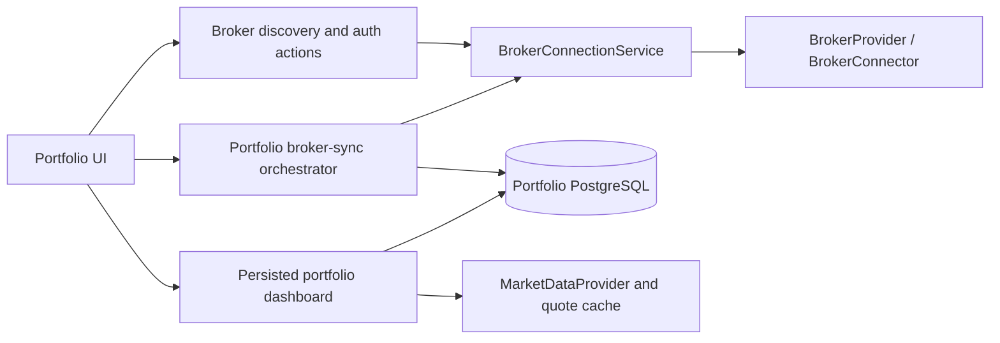
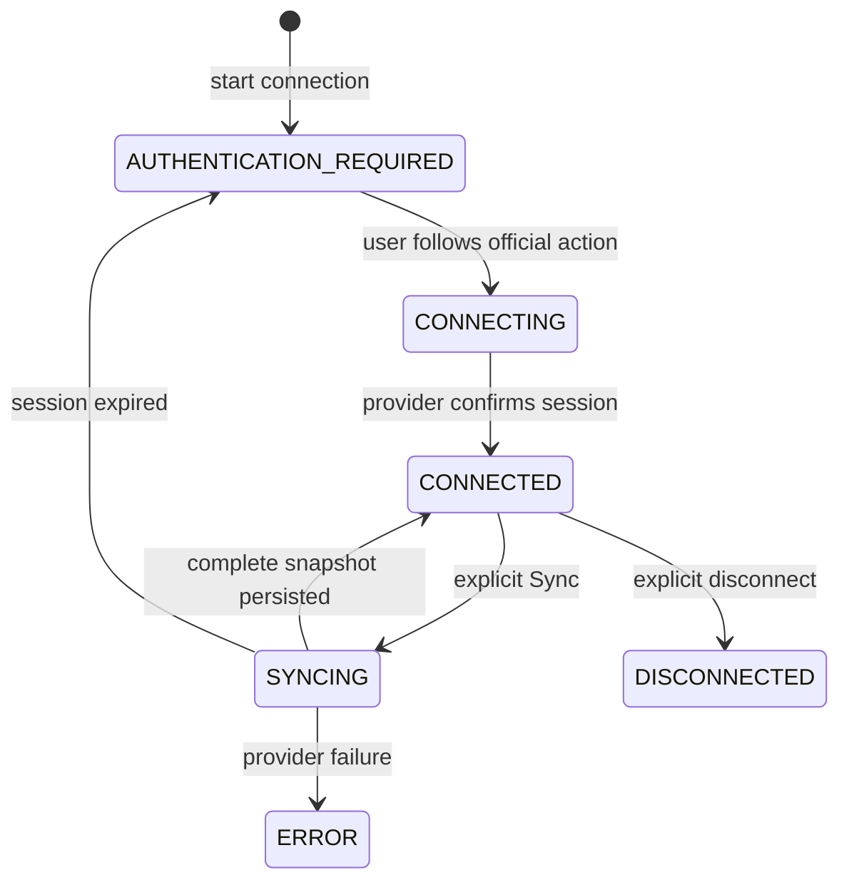

# Phase 5E scalable multi-broker architecture

## 1. Final architecture

Phase 5E separates authorization, connection state, ownership synchronization, persisted portfolios, and market valuation.

Portfolio data loads from PostgreSQL without a live broker session. A broker session is needed only to synchronize ownership and cash. Quote retrieval is a separate read through the existing market-data provider/cache; broker APIs are not the default quote source.

## 2. Authentication models

`BrokerAuthenticationModel` is independent from capabilities:

| Model | Meaning |
|---|---|
| `LOCAL_GATEWAY` | A user-scoped local connector or gateway, currently IBKR |
| `INDIVIDUAL_API_CREDENTIALS` | User-owned API application credentials, currently retail Breeze |
| `PLATFORM_OAUTH` | Future platform application with per-user authorization |
| `PARTNER_OAUTH` | Future negotiated broker partnership |
| `CONSENT_AGGREGATOR` | Future regulated consent/data aggregation |
| `UNSUPPORTED` | No verified authentication contract |

Assignments: IBKR is `LOCAL_GATEWAY`; ICICI Direct retail Breeze and HDFC InvestRight Individual API are `INDIVIDUAL_API_CREDENTIALS`. HDFC remains publicly `UNSUPPORTED` for the desired consumer flow because no public multi-customer Partner API contract is available.

### Verified authentication contracts (reviewed 2026-08-29)

| Broker | Official product | Model | Credential ownership / multi-user support | Login and return | Token/session behavior | Read APIs | Quota | Consumer UX readiness |
|---|---|---|---|---|---|---|---|---|
| Interactive Brokers | Client Portal Gateway | `LOCAL_GATEWAY` | User-scoped Gateway runtime; the platform persists only its own connector identity | Gateway supplies its login URL; authentication occurs in the official IBKR UI | Runtime reports authenticated/expired state; re-authentication reuses the same connector ID | Accounts, positions and cash implemented read-only | No new quota assumption | **Supported in DEV** |
| ICICI Direct | Breeze retail API | `INDIVIDUAL_API_CREDENTIALS` | The customer registers an app and owns its AppKey/secret. No public contract permits one platform app for unrelated customers | ICICI-hosted login accepts AppKey and returns to a registered redirect with `API_Session`; no documented `state` contract was found | Customer Details exchanges `API_Session` for a signed-request session token; public refresh/lifetime contract is incomplete, so re-login is required when invalid | Customer Details, Demat Holdings and Funds are documented and already available through inspection APIs | 100 calls/minute and 5,000/day; official documentation does not define the scope key | **Blocked pending Partner API contract** |
| HDFC Securities | InvestRight Individual API | `INDIVIDUAL_API_CREDENTIALS` | Each account holder creates an app/API key and secret. HDFC’s official support states these are exclusive to that account; Partner APIs require commercial contact | Individual API documents frontend/API access-token acquisition and a registered redirect URL, but this is not a public platform-wide authorization grant; public `state`/CSRF terms were not verified | Access token is used with API key; a scalable refresh/revocation contract for unrelated customers is not public | Profile, holdings/portfolio, positions, and funds/margins are documented | No authoritative production read quota was found | **Blocked pending Partner API contract** |

Official evidence:

- ICICI Direct: [Breeze API reference](https://api.icicidirect.com/breezeapi/documents/index.html), including registration, redirect login, Customer Details exchange, signing headers, holdings/funds endpoints, and published rate limits.
- HDFC Securities: [InvestRight Open API portal](https://developer.hdfcsec.com/), [Individual API announcement and credential setup](https://www.hdfcsec.com/blog/details/introducing-individual-api-for-investright-clients), and [InvestRight API documentation](https://developer.hdfcsec.com/ir-docs/docs/intro). HDFC’s official InvestRight community response states individual keys are exclusive to their account holder and directs platform integrations to Partner APIs.

The words OAuth or redirect in an individual product do not establish delegated multi-customer authorization. Platform-owned credentials, callback parameters, CSRF/state guarantees, scopes, token lifetimes, refresh behavior, quotas, and partner onboarding must come from the applicable written provider contract before either provider becomes connectable.

## 3. Provider capability model

Capabilities continue to describe implemented operations, not authentication style. `ORDER_EXECUTION` is filtered and remains prohibited by the shared capability value object. ICICI retains verified account, Demat Holdings, and funds inspection behavior, while `PORTFOLIO_READ` remains absent because its normalized holdings are not valuation-complete. HDFC advertises no capabilities.

## 4. Connection lifecycle

The existing shared lifecycle covers `AUTHENTICATION_REQUIRED`, `CONNECTING`, `CONNECTED`, `SYNCING`, `ERROR`, and `DISCONNECTED`. Generic discovery exposes a safe descriptor. A connection-scoped authentication-action endpoint normalizes `NONE`, `REDIRECT_REQUIRED`, `POPUP_REQUIRED`, `USER_CREDENTIALS_REQUIRED`, `CONSENT_REQUIRED`, `AUTHENTICATION_REQUIRED`, `UNAVAILABLE`, and `UNSUPPORTED` without returning credentials, cookies, or raw tokens.

## 5. Portfolio auto-create and reuse

The stable broker-backed portfolio key is:

`authenticated user + broker connection + provider broker account`

The display name is presentation only. A unique database index on `(user_id, broker_connection_id, broker_account_id)` protects concurrent creation. A synchronization creates one portfolio for each broker account, or reuses the matching portfolio. Reconnection/synchronization never selects a portfolio by name.

## 6. Legacy adoption

Existing portfolios are preserved. A legacy portfolio is adopted only when all existing positions unambiguously identify the same connection, broker account, and provider. Zero or multiple candidates are not inferred. Existing Phase 5C position-level adoption remains ownership-scoped.

## 7. Synchronization lifecycle

`POST /api/v1/portfolios/broker-connections/{connectionId}/sync`:

1. derives the application user from trusted authentication headers;
2. asks broker-service to synchronize/check the owned connection;
3. requires `CONNECTED` and `PORTFOLIO_READ`;
4. obtains one complete authoritative snapshot before mutation;
5. partitions accounts, holdings, and cash by broker account;
6. creates or reuses the source portfolio;
7. applies Phase 5C provider-native upsert and sync-generation semantics;
8. marks missing positions inactive only inside the completed source snapshot;
9. records the successful broker-sync timestamp;
10. returns the affected portfolios.

The operation is idempotent. An in-process connection lock prevents duplicate clicks in one instance, a broker-service pessimistic row lock serializes a connection across requests, and database uniqueness is the final race guard.

## 8. Failure semantics

Provider/authentication failure occurs before portfolio mutation. A missing, malformed, or incomplete snapshot is an error, never an empty successful portfolio. Transaction rollback protects against persistence failures. Existing holdings and last successful sync remain visible. Only a successfully received authoritative empty account snapshot can inactivate positions within that exact source.

## 9. Market data versus broker sync

Broker sync answers ownership and cash. Market data answers valuation. Dashboard and position reads use the existing `MarketDataProvider`, which can use the existing quote cache, independently of broker sessions. Broker freshness (`lastBrokerSyncAt`) and quote freshness (`quote.sourceTimestamp`, freshness/source) are separately rendered. No automatic broker sync occurs at application login.

## 10. Currency aggregation

`GET /api/v1/portfolios/dashboard` returns `currencyTotals` keyed by ISO currency. Aggregation uses Java `BigDecimal` and only adds values within the same currency bucket. No implicit FX conversion or single global total is produced. Portfolios with unknown/incomplete valuation are explicitly listed in `incompleteValuationPortfolioIds`.

## 11. Frontend flow

- On application login, load `/api/v1/portfolios/dashboard` immediately.
- Render an `All` tab plus one tab for every persisted portfolio.
- Render same-currency totals separately and all source-scoped holdings.
- Populate the broker selector from `/api/v1/brokers`.
- Start a connection through the generic connect operation, then obtain its normalized authentication action.
- Synchronously open a blank popup in the user click handler, before awaiting the connection/authentication API, so browser popup policy preserves the user gesture.
- Navigate that same popup only for `REDIRECT_REQUIRED` or `POPUP_REQUIRED`; otherwise close it and render the normalized provider message.
- A blocked popup, missing authentication URL, or API failure is reported safely and never hides the persisted portfolio.
- On Sync, call the generic portfolio synchronization endpoint; if authentication is required, obtain the provider action and resume after authentication.
- Disconnecting a connection does not delete its persisted portfolio.

## 12. IBKR migration

IBKR remains behind `BrokerConnector` and its existing Client Portal Gateway implementation. The generic action delegates to its scoped connector login URL; no connector ID is needed by the UI. The generic portfolio sync consumes the established account/position/cash snapshot and creates or reuses account portfolios. No IBKR authentication algorithm was changed.

## 13. ICICI limitations

Retail Breeze is accurately described as individual API credentials. Its provider and inspection endpoints remain. The generic portfolio synchronizer refuses it while `PORTFOLIO_READ` is absent, so incomplete Demat records cannot weaken portfolio constraints or fabricate price, cost, exchange, or currency. Commercial partner authentication remains a future phase.

## 14. HDFC integration point

`HDFC_SECURITIES` exists only as discoverable, non-connectable metadata with no advertised capabilities. The verified InvestRight Individual API requires account-holder-owned credentials and therefore is not wired into the normal consumer flow. A future Partner API adapter must be based on HDFC's written multi-customer authorization, callback/state, token, quota, and read-scope contract. There are no guessed URLs or API fields.

## 15. Security and tenancy

All controllers derive the user from trusted authenticated context. Broker-service validates connection ownership before status, authentication action, sync, snapshot, and disconnect. Portfolio repositories require user ownership; source portfolio adoption additionally checks provider/connection/account identity. Secrets and sessions remain broker-service concerns and are never stored in portfolio-service or returned in dashboard responses. Generic connection responses also omit user IDs, connector IDs, external account references, and internal session references.

## 16. Observability

Synchronization logs provider, connection ID, result, portfolio count, position count, duration, and safe error category. It does not log credentials, authentication headers, cookies, sessions, or broker payloads.

## 17. Database change

Flyway `V10__broker_backed_portfolio_identity.sql` adds nullable source identity and broker-sync freshness columns to `portfolios`, a unique source index, and an ownership/connection lookup index. V1-V9 are unchanged. Existing data remains valid because all new columns are nullable.

## 18. API contracts

- `GET /api/v1/brokers`: consumer-safe descriptors including display name, connectability, reason, and status. Authentication models and raw capabilities remain internal domain/provider concerns.
- `POST /api/v1/broker-connections/{provider}/connect`: creates an owned connection using the provider implementation.
- `GET /api/v1/broker-connections/{id}/authentication-action`: safe normalized next action.
- `GET /api/v1/broker-connections/{id}/status`: owned connection status.
- `POST /api/v1/portfolios/broker-connections/{id}/sync`: connection sync plus portfolio create/reuse/import.
- `DELETE /api/v1/broker-connections/{id}`: disconnect without portfolio deletion.
- `GET /api/v1/portfolios/dashboard`: persisted portfolios, currency totals, all holdings, and incomplete-valuation markers.

Provider-specific ICICI inspection/session endpoints and connector-specific compatibility endpoints remain available but are no longer required by the generic UI.

## 19. Test coverage

Coverage includes broker descriptors/authentication models, unavailable HDFC, generic IBKR authentication actions and cross-user denial, connection locking, portfolio create/reuse, multiple accounts, repeated snapshot idempotency, source-scoped missing-position handling, failure preservation, cash, deterministic currency buckets, Flyway V10, and all earlier IBKR/ICICI/Phase 5C tests.

## 20. Known gaps and future phases

- Live IBKR validation requires an already authenticated DEV session; automated tests remain mock-bound.
- Durable distributed sync coordination beyond database row/index protection may be added if sync becomes asynchronous.
- A production ICICI route awaits a verified partner/commercial contract.
- ICICI and HDFC require commercial Partner API onboarding and written multi-customer authentication contracts. Their individual developer credentials are deliberately not requested in the consumer UI.
- Incomplete ICICI/HDFC ownership data is not persisted as a fully valued `PortfolioPosition`. A future holdings-only model should use a separate deliberate representation with nullable valuation and explicit provenance rather than relaxing Phase 5C constraints.
- Market-data coverage remains limited to existing providers/cache; unsupported instruments display last-known broker valuation with explicit freshness.
- A regulated Account Aggregator/FIU route and optional explicit FX view are separate future work.

## 21. Phase 5E.1 UX and legacy-adoption correction

The consumer broker page now exposes only broker name, friendly connection state, a short explanation, linked portfolio name, and Connect/Re-authenticate/Manage/Disconnect actions. Demo Broker is excluded from public discovery unless `broker.public-demo-enabled=true`; its compatibility endpoint remains available for tests. ICICI Direct and HDFC Securities remain cleanly unavailable. Authentication-model and capability enum lists are no longer part of public discovery/authentication-action DTOs.

An expired IBKR session is returned as normalized `AUTHENTICATION_REQUIRED` rather than thrown as a generic provider error. Portfolio Sync uses the connection-level authentication action and can be retried after sign-in. Broker-page Sync was removed; only a linked broker-backed portfolio renders Sync.

On persisted portfolio listing, portfolio-service performs an idempotent, authentication-independent legacy adoption when every position is real broker data and resolves to exactly one Phase 5C `(connection, provider, broker account)` source. It attaches the existing portfolio row to that identity without changing position IDs, quantities, source identity, activity, or sync generations. Multiple sources are logged as ambiguous and left untouched. V10 already supplies the necessary columns and unique index, so no V11 migration is required.

The gateway narrowly forwards `/`, `/_next/**`, `/favicon.ico`, and `/robots.txt` to the frontend service. Existing `/api/**` routes retain their current backend routing and authentication behavior.
